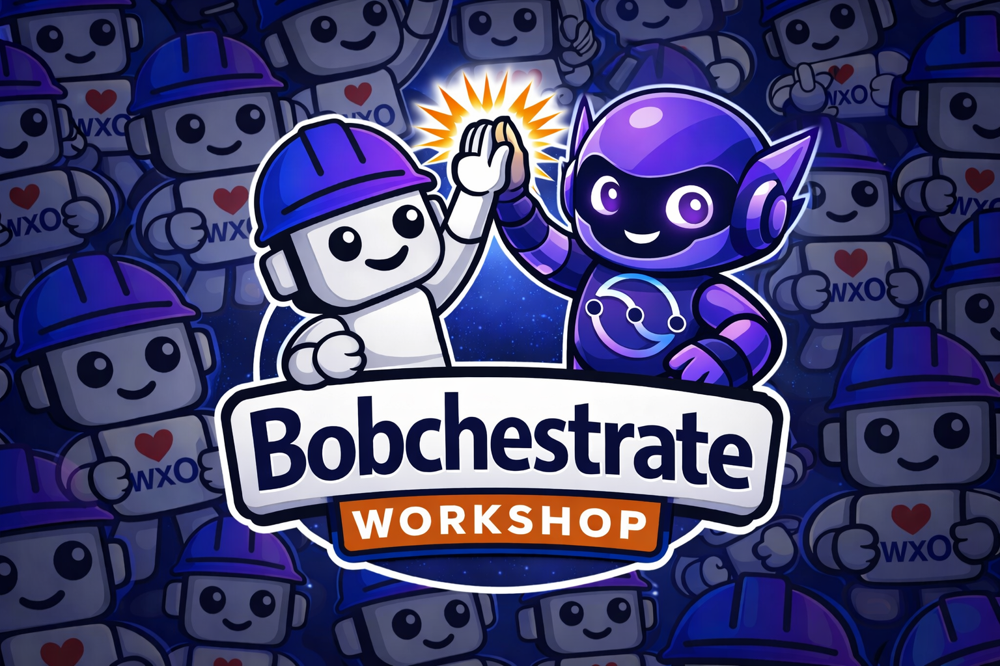

# Bobchestrate Workshop - Building AI Agents with watsonx Orchestrate and IBM Bob

## A Hands-On Workshop for Agentic AI Development

Welcome! This workshop will guide you through building AI agents using IBM watsonx Orchestrate. You'll use IBM Bob, an AI coding assistant, to help you along the way.

## Workshop Overview

**Duration:** 270-300 minutes (4.5-5 hours) for complete workshop

This estimate includes:

- Core instruction time: 220 minutes
- Setup and troubleshooting: 20-30 minutes
- Short breaks: 15-20 minutes
- Q&A and discussion: 15-30 minutes

**Alternative Options:** 
- **Core Workshop** (Parts 1-7): 210-240 minutes (3.5-4 hours) 
- **Advanced Exercise Only** (Part 1 + Part 8): 60-75 minutes (1-1.25 hours) - Setup plus multi-agent orchestration as standalone exercise

**Level:** Beginner to Intermediate (Advanced for Part 8)

**Prerequisites:** 
- Computer with internet access, Windows, macOS, or Linux operating system, at least 8GB RAM and 500 MB of free disk space 
- Basic Python knowledge and Python 3.11-3.13 installed ([https://www.python.org/downloads/](https://www.python.org/downloads/)) 
- uv installed ([https://pypi.org/project/uv/](https://pypi.org/project/uv/)) 
- watsonx Orchestrate SaaS access (provided by your instructor or you can use your own) 
- IBM Bob IDE installed (trial or one provided by your instructor)

## What You'll Build

Throughout this workshop, you'll build progressively more sophisticated AI agents:

### 1. Hello World Agent (Part 2)
Your first simple agent to understand the basics of agent configuration and behavior.

### 2. Customer Support System (Parts 3-5)
A complete customer support solution featuring: 
- **Custom Python tools** for order status checking and refund processing 
- **Knowledge base integration** for FAQ handling 
- **Specialized escalation agent** for complex issues 
- **Safety guidelines and guardrails** for responsible AI

### 3. Product Catalog System (Part 6)
An **MCP server-powered agent** that demonstrates backend integration: 
- Product search and details 
- Inventory checking 
- Product recommendations 
- Reusable MCP server architecture

### 4. Testing & Deployment (Part 7)
Learn to **test and deploy** your customer support agent: 
- Comprehensive testing strategies 
- Unit and integration testing 
- Deployment best practices 
- Monitoring and observability 
- Production readiness checklist

Each system builds on concepts from previous parts, teaching you to create increasingly sophisticated agentic AI solutions.

## Workshop Structure

### [Part 1: Setup & Environment](part1-setup/README.md) (15 min)
- Configure watsonx Orchestrate credentials
- Verify Bob is working as your AI development partner
- Understand the project structure
- Set up your development environment

### [Part 2: Building Your First Agent](part2-first-agent/README.md) (20 min)
- Create a simple "Hello World" agent
- Understand agent instructions and behavior
- Test your agent with the chat interface
- Learn how to use Bob to help debug issues

### [Part 2b: Using Custom Rules with Bob IDE](part2b-bob-custom-rules/README.md) (10 min)
- Learn how to configure Bob with custom development rules
- Understand the watsonx Orchestrate development rule
- Set up project-specific conventions for Bob
- Create your own custom rules for consistent development

### [Part 3: Adding Custom Tools](part3-custom-tools/README.md) (30 min)
- Create a Python tool to check order status
- Create a tool to process refund requests
- Import tools into your agent
- Use Bob to help write and debug tool code

### [Part 3b: AI Gateway and Using Different Models](part3b-ai-gateway-models/README.md) (25 min)
- Understand the AI Gateway architecture
- Learn about different LLM providers and models
- Configure agents with different models
- Compare model performance and costs
- Create intelligent model routing agents
- Best practices for model selection

### [Part 4: Knowledge Bases & Collaborators](part4-knowledge/README.md) (25 min)
- Add a knowledge base for FAQs
- Create a specialized escalation agent
- Connect agents as collaborators
- Test the complete customer support flow

### [Part 5: Agent Guidelines & Guardrails](part5-guidelines-guardrails/README.md) (20 min)
- Write comprehensive agent guidelines
- Implement content safety guardrails
- Create input/output filtering plugins
- Test safety measures and compliance
- Learn responsible AI best practices

### [Part 6: MCP Servers - Connecting to Backend Services](part6-mcp-servers/README.md) (25 min)
- Understand what MCP servers are and their benefits
- Create an MCP server in Python with multiple tools
- Define tool schemas and implement tool logic
- Import MCP servers into watsonx Orchestrate
- Use MCP server tools in your agents
- Learn MCP best practices and patterns

### [Part 7: Testing & Deployment](part7-deployment/README.md) (20 min)
- Test your agent thoroughly
- Deploy to different environments
- Generate webchat embed code
- Monitor agent performance

### [Part 8: Multi-Agent Orchestration & Workflows](part8-multi-agent-orchestration/README.md) (30 min)
- Understand when and why to use multi-agent systems
- Design focused specialist agents for specific domains
- Create orchestrator agents with intelligent routing
- Manage context and handoffs between agents
- Implement complex multi-agent workflows
- Learn best practices for agent hierarchies
- **Advanced standalone exercise** - Build a complete travel planning system

## How Bob Helps You

Throughout this workshop, you'll use Bob to: 
- **Generate code**: "Bob, create a Python tool that checks order status" 
- **Debug issues**: "Bob, why is my agent not calling the refund tool?" 
- **Explain concepts**: "Bob, explain how agent instructions work" 
- **Refactor code**: "Bob, improve the error handling in my tool" 
- **Create tests**: "Bob, write tests for my order status tool"

## Learning Objectives

By the end of this workshop, you will: 
✅ Understand watsonx Orchestrate agent architecture 
✅ Create and configure agents using YAML specifications 
✅ Build custom Python tools for specific business logic 
✅ Integrate knowledge bases for FAQ handling 
✅ Use agent collaborators for complex workflows 
✅ Configure and use different AI models through the AI Gateway 
✅ Implement safety guidelines and guardrails 
✅ Create and use MCP servers for backend integration 
✅ Design and orchestrate multi-agent systems 
✅ Build responsible AI agents 
✅ Leverage Bob as an AI pair programmer 
✅ Test and deploy agents to production

## Tips for Success

1. **Ask Bob for help**: Don't hesitate to ask Bob questions throughout the workshop
2. **Experiment**: Try modifying the examples to see what happens
3. **Read error messages**: They often tell you exactly what's wrong
4. **Test incrementally**: Build and test one feature at a time
5. **Use the documentation**: Bob can search the watsonx Orchestrate docs for you

## Additional Resources

- [Bob Helpful Prompts](bob-prompts/helpful-prompts.md)
- [watsonx Orchestrate Documentation](https://developer.watson-orchestrate.ibm.com/)
- [Python Tools Guide](https://developer.watson-orchestrate.ibm.com/tools/create_tool)
- [Agent Builder API Reference](https://developer.watson-orchestrate.ibm.com/apis/agents/)
- [Community Forum](https://community.ibm.com/community/user/watsonai/communities/community-home?CommunityKey=7a3dc5ba-3018-452d-9a43-a49dc6819633)

## Need Help?

- Ask Bob: "Bob, I'm stuck on [specific issue]"
- Check the solutions folder for reference implementations
- Review the bob-prompts guide for helpful prompts
- Consult the watsonx Orchestrate documentation

## Getting Started

Let's get started! Head to [Part 1: Setup](part1-setup/README.md) →