# Part 1: Setup & Environment

**Duration:** 15 minutes  
**Objective:** Get your development environment ready for building watsonx Orchestrate agents

## Prerequisites Check

Before starting, ensure you have:
- [ ] Python 3.11-3.13 installed
- [ ] IBM Bob IDE installed
- [ ] watsonx Orchestrate access (SaaS or Developer Edition)

## Step 1: Verify Python Installation

Open a terminal and run:
```bash
python --version
# or
python3 --version
```

## Step 2: Verify uv Installation

Open a terminal and run:
```bash
uv --version
```

## Step 3: Create Workshop Folder

Create a dedicated folder for your workshop project - you can place it where ever you want:

```bash
mkdir bobchestrate-ws
cd bobchestrate-ws
```

This folder will contain all your workshop files, agents, and tools.

## Step 4: Open Folder in IBM Bob IDE

Open the workshop folder in IBM Bob IDE:
1. Launch IBM Bob IDE
2. Click **File** → **Open Folder**

   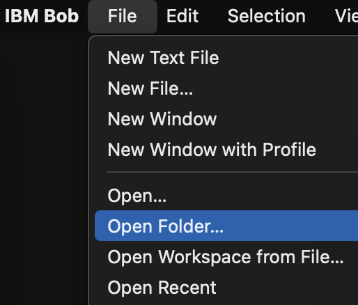


3. Navigate to and select the `bobchestrate-ws` folder
4. Click **Open**
5. Click **Yes, I trust the author** to trust the workspace

   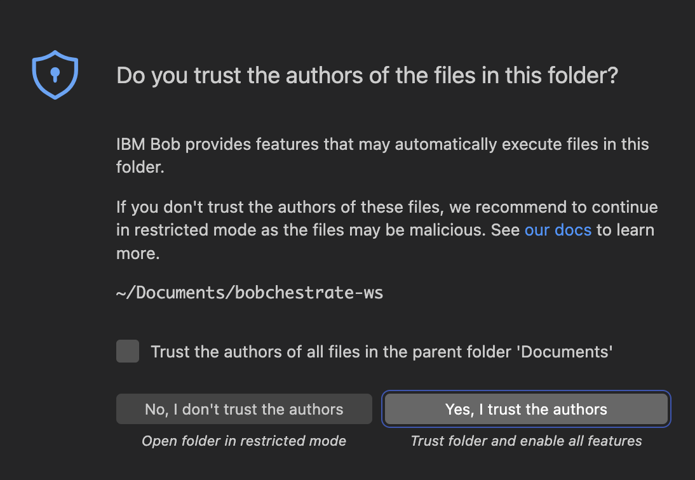

The empty workspace will open.

## Step 5: Install watsonx Orchestrate ADK VS Code Extension

Install the watsonx Orchestrate extension for IBM Bob IDE:

1. Open the Extensions view in IBM Bob IDE (Click the Extensions icon in the Activity Bar or press `Cmd+Shift+X` on Mac / `Ctrl+Shift+X` on Windows/Linux)

   

2. Search for "watsonx Orchestrate"

    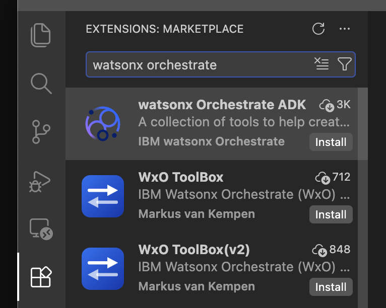

3. Click **Install** on the "IBM watsonx Orchestrate ADK" extension
4. Wait for the installation to complete
5. Reload VS Code if prompted
6. You should now see the extension icon appear in the Activity Bar:

   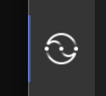

The extension provides:
- Syntax highlighting for agent YAML files
- IntelliSense for agent configuration
- Quick access to watsonx Orchestrate commands
- Integration with the Orchestrate CLI

## Step 6: Install watsonx Orchestrate MCP Servers

Install the watsonx Orchestrate MCP servers through the ADK extension:

1. Open the Command Palette in IBM Bob IDE (press `Cmd+Shift+P` on Mac / `Ctrl+Shift+P` on Windows/Linux)
2. Type "watsonx Orchestrate: Install MCP Servers" and select it
3. Wait for the installation to complete
4. You should see a confirmation message that the MCP servers have been installed successfully

**Verify the installation:**

To confirm the MCP servers are installed and working:

1. Open Bob's chat panel in IBM Bob IDE
2. Ask Bob: "What MCP servers are available?"
3. You should see the following watsonx Orchestrate MCP servers listed:
   - `watsonx-orchestrate-adk` - Provides tools for interacting with watsonx Orchestrate (list agents, tools, etc.)
   - `watsonx-orchestrate-adk-docs` - Provides access to watsonx Orchestrate documentation

Alternatively, you can check the MCP servers configuration:
1. Open the Command Palette (`Cmd+Shift+P` / `Ctrl+Shift+P`)
2. Type "MCP Servers" and select it
3. Verify that the watsonx Orchestrate MCP servers are listed in the configuration and both of them marked with a green bullet point

   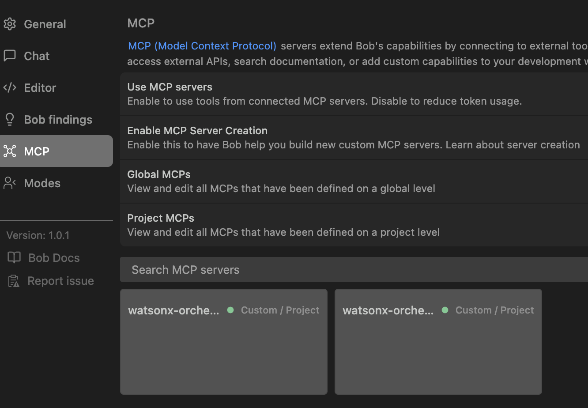

The MCP servers provide:
- Access to watsonx Orchestrate documentation
- Integration with the watsonx Orchestrate ADK
- Tools for listing agents, tools, and other resources
- Enhanced Bob capabilities for watsonx Orchestrate development

## Step 7: Import WXO Agent Architect Mode

Import a pre-configured custom mode specialized for building watsonx Orchestrate agents:

1. Download the mode configuration file from GitHub:
   - Visit: https://github.com/juseljuk/bobchestrate-workshop/blob/main/part1-setup/files/wxo-agent-architect-export.yaml
   - Click the **Download raw file** button

      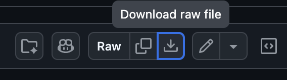

   - Save the file to your Downloads folder or a location you can easily access

2. Open the Command Palette in IBM Bob IDE (press `Cmd+Shift+P` on Mac / `Ctrl+Shift+P` on Windows/Linux)

3. Type "Modes" and select it

4. Click on **Import** icon in the modes panel

   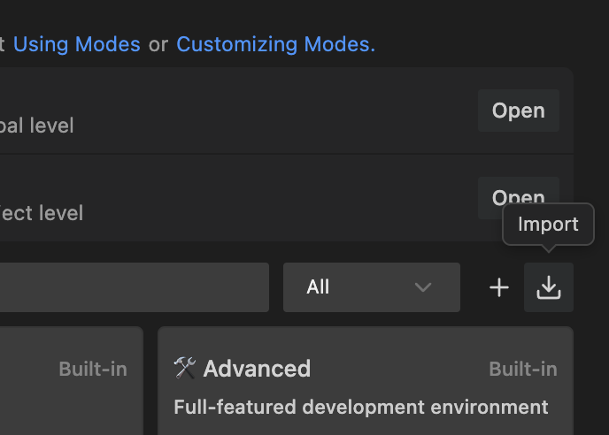
   
5. Select the `wxo-agent-architect-export.yaml` file you downloaded and click **Open**

6. You should see a confirmation message that the mode was imported successfully and see the mode appear in the modes panel

The imported "WXO Agent Architect" mode includes:
- **Role Definition**: Specialized for building watsonx Orchestrate agents
- **Custom Instructions**: Guidance on using MCP servers for agent development
- **MCP Server Integration**: Automatically uses both `watsonx-orchestrate-adk` and `watsonx-orchestrate-adk-docs` servers
- **Tool Groups**: Access to read, edit, browser, command, and MCP tools

**Verify the mode:**

1. Open Bob's chat panel if not already open
2. Click on the mode selector (usually shows the current mode like "Code" or "Ask")
3. You should see "WXO Agent Architect" in the list of available modes
4. Select "WXO Agent Architect" mode
5. Ask Bob: "What can you help me with in this mode?"
6. Bob should respond with information about building watsonx Orchestrate agents and mention the available MCP servers

## Step 8: Create Python Virtual Environment

Create a virtual environment for the workshop to keep dependencies isolated using IBM Bob IDE's built-in commands:

1. Open the Command Palette in IBM Bob IDE (press `Cmd+Shift+P` on Mac / `Ctrl+Shift+P` on Windows/Linux)
2. Type "Python: Create Environment" and select it
3. Choose "Venv" as the environment type
4. Select your Python interpreter (Python 3.11-3.13)
5. Wait for the virtual environment to be created

You can now see the .venv folder in your workspace explorer view.

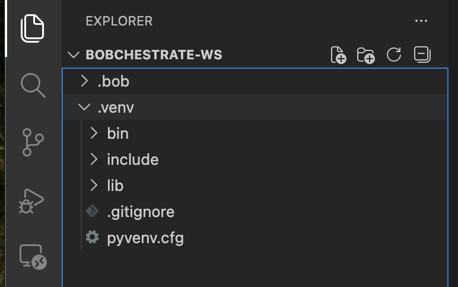

IBM Bob IDE will automatically:
- Create a `.venv` folder in your workspace
- Activate the virtual environment in new terminals
- Show `(.venv)` in your terminal prompt

> **_Note:_** The virtual environment will be automatically activated when you open new terminals in IBM Bob IDE.

> **_Note2:_** If you're wondering about the .bob folder, it was created automatically when you installed the MCP Servers for Orchestrate. This folder contains all the IBM Bob IDE configuration files for the MCP Servers for Orchestrate. It's safe to leave it there.

## Step 9: Install watsonx Orchestrate SDK

Since you have the watsonx Orchestrate ADK extension installed, you will see the ADK informaton in the bottom Status Bar. Since we just created a fresh Python virtual environment to our workspace, you should see just a red cross stating that you need to install the ADK.

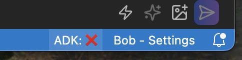

Click on the red cross to install the ADK. This will open a couple of commands to the search/command bar. Select the one to install the ADK.

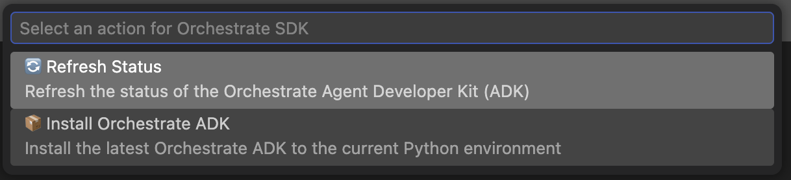

Wait for the installation to complete. After a while, you should see a notification and a green checkmark in the Status Bar with the latest version number of the ADK.

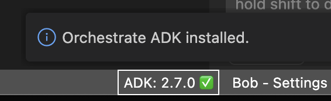

## Step 10: Get Your watsonx Orchestrate API key and API URL

For the workshop, we will use the watsonx Orchestrate ADK to interact with a watsonx Orchestrate SaaS instance. The ADK requires your API key and API URL to authenticate and connect to your watsonx Orchestrate instance.

> **_Note:_** `Your instructor will provide you with the API key and API URL for your watsonx Orchestrate instance.` If you are using your own instance, you can follow the instructions below to get the needed API key and the API URL.

### OPTIONAL: Using your own watsonx Orchestrate SaaS instance

<ins>To generate an API key for the ADK:</ins>

1. In your watsonx Orchestrate console, click on your **profile icon** in the top-right corner
2. Select **Settings** from the dropdown menu
3. Navigate to the **API details** tab
4. Click **Generate API key** button

   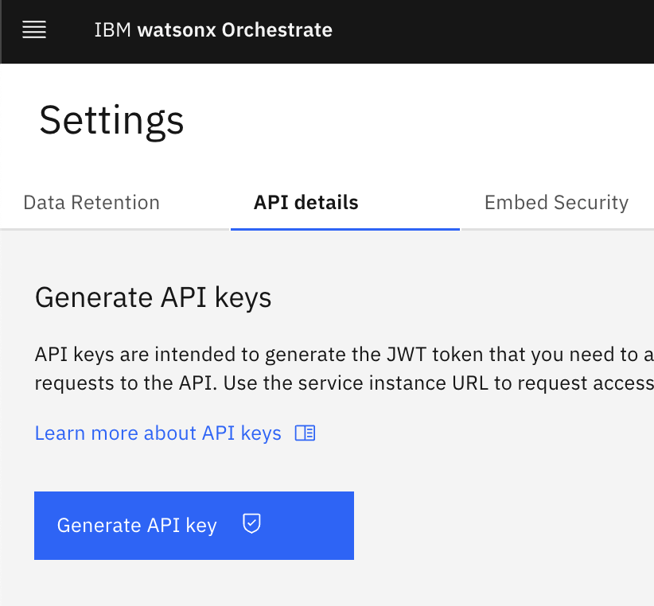

5. When the key is generated, click **Copy** to save it to your clipboard
6. **Important**: Copy the API key immediately and _store_ it securely
   - The key will only be shown once
   - If you lose it, you'll need to create a new one

> **Security Best Practice**: Treat your API key like a password. Never commit it to version control or share it publicly.

<ins>To get the API URL:</ins>

Copy the Service instance URL from the API details information. This is the base URL for your watsonx Orchestrate instance.

   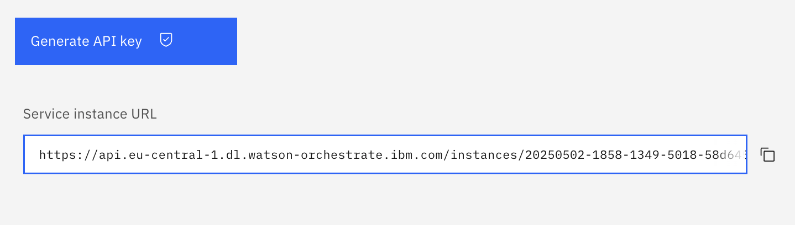

### Configure the ADK Environment

#### Option A: Using the ADK CLI - check out the Option B before deciding which option to use 😉

1. Open a terminal window within Bob IDE:

   - From the Bob main menu bar, select **Terminal** > **New Terminal**

      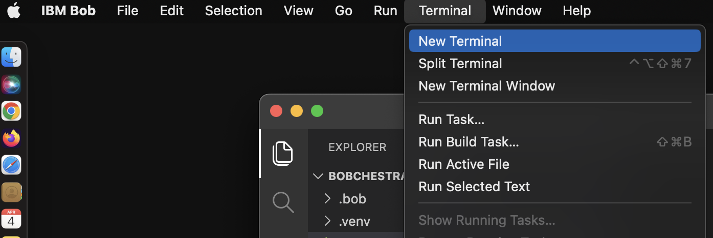
   
   - This will open a terminal window in the Bob IDE - notice that your Python environment is already activated

      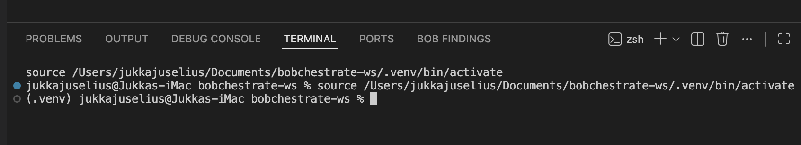

2. Run the following command in your terminal to **add** your environment:

   ```bash
   orchestrate env add -n <your-env-name> -u <your-api-url>
   ```
   Where `<your-env-name>` is a name you choose for your environment (e.g., "my-wxo-cloud") and `<your-api-url>` is the URL you got in Step 10.
   
   After running the command, you should see a message: `[INFO] Environment '<your-env-name>' has been created`

3. Run the following command to **activate** the environment:

   ```bash
   orchestrate env activate <your-env-name> -a <your-api-key>
   ```
   Where `<your-env-name>` is a name you choose for your environment (e.g., "my-wxo-cloud") and `<your-api-key>` is the API key you got in Step 10.
   
   After running the command, you should see a message: `[INFO] Environment '<your-env-name>' is now active`. This means your environment is now active and ready to use with the ADK. You can ignore the warning regarding the Auth Type.

#### Option B: Using Bob to help you 😃

Now that you have watsonx Orchestrate MCP servers and the WXO Agent Architect mode enabled, you can use Bob to help you with the setup.

1. Make sure that you have the **WXO Agent Architect** mode selected for your Bob chat. Then ask Bob to create a script to add and activate new watsonx Orchestarte environment for the ADK:

   ```
   Create a simple shell script to add and activate new watsonx Orchestrate SaaS environment for the ADK. I have the environment URL and API key ready.
   ```

   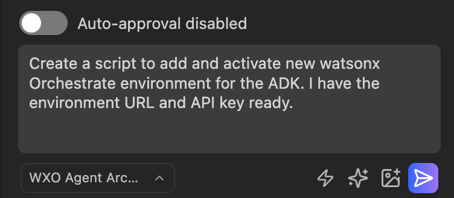

2. When Bob starts working, it will be asking for a permissionm to access watsonx-orchestarte-adk-docs MCP server. Click on the **Aprove** button to allow Bob to access the documentation.

   >Note: You can also check the **Always allow** checkbox to always allow Bob to access the MCP server. One option is to enable **Auto-approval**. If you do this, you can specify the different options that you want to allow.

      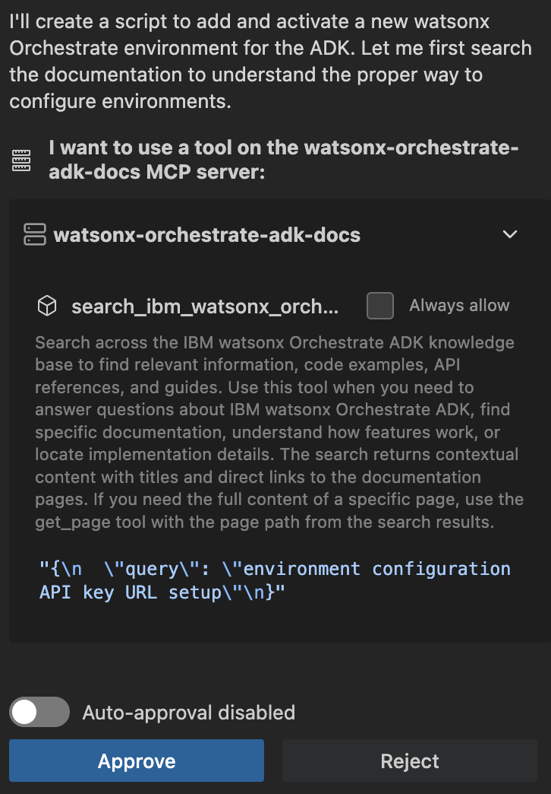

   >Note: Bob might ask you to approve the MCP server access multiple times. This is because Bob is trying to access the MCP server to get the more detailed information after first learning about the environment setup. Recommendation is to enable **Auto-approval** for the MCP servers to avoid granting the permission manually each time.

3. After Bob has created the script (e.g. _add_wxo_env.sh_, name could be something else for you), it will ask you to permission to save the script. Click on the **Save** button to save the script.

4. Next, Bob will create a documentation - an MD-file - for the script. Click on the **Save** button to save the documentation.

5. After Bob has saved the documentation, it will ask you to permission to make the script executable. Click on the **Run** to execute the command.

6. Finally Bob will summarize the task for you.

    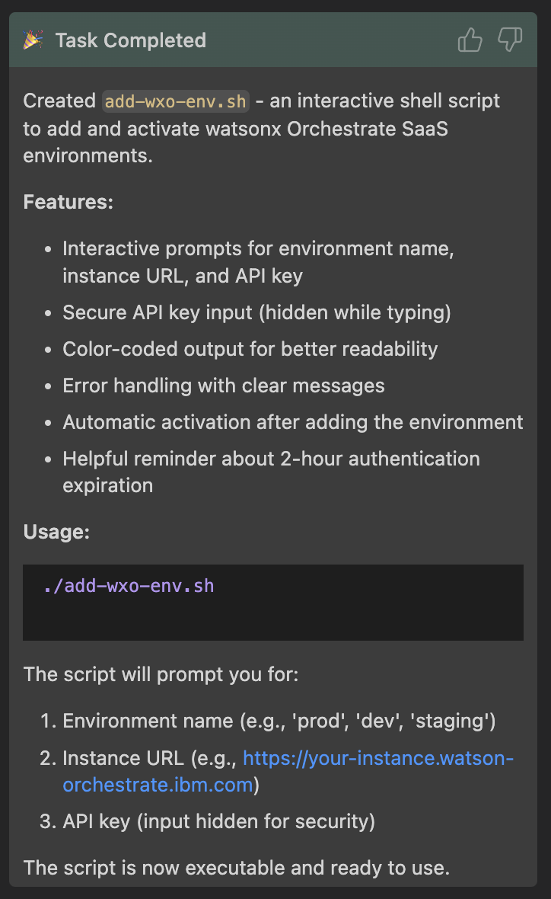

7. Open a terminal window within Bob IDE:

   - From the Bob main menu bar, select **Terminal** > **New Terminal**

      
   
   - This will open a terminal window in the Bob IDE - notice that your Python environment is already activated

      

8. Run the created script in your terminal to **add** your environment:

   `./<name of your cerated script>, e.g. ./_add_wxo_env.sh`

9. When asked, provide name for your environment, e.g. `my-wxo-cloud`:

   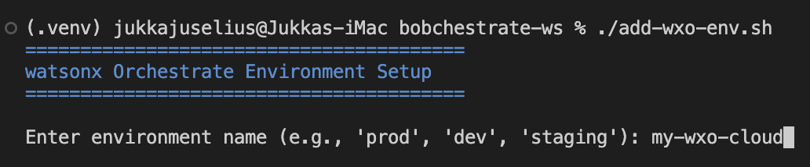

10. When asked, provide the URL of your Orchestrate instance that you got earlier:

      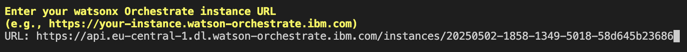

11. When asked, provide the API key of your Orchestrate instance that you got earlier. The script will then create a new environment and activate it:

      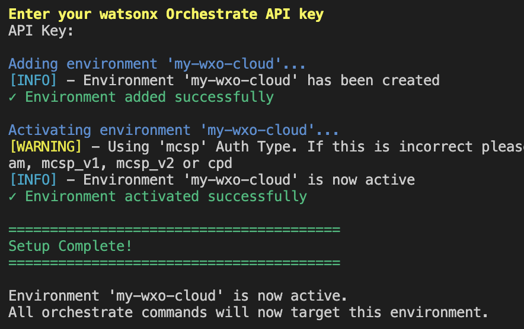

12. Verify your connection is working. Run the following command in your Bob IDE terminal:

      ```bash
      orchestrate agents list
      ```

      If configured correctly, this command will list any agents in your environment (or show an empty list if you haven't created any agents yet).

## Step 11: Understand the Workshop Structure

Your workshop folder should look like this:

```
bobchestrate-workshop/
├── README.md                           # Main workshop guide
├── GETTING-STARTED.md                  # Quick start guide
├── .bob/                               # Bob IDE configuration
├── bob-prompts/                        # Helpful Bob prompts
│   └── helpful-prompts.md
├── part1-setup/                        # You are here!
│   ├── README.md
│   ├── verify-setup.py
│   ├── files/
│   │   └── wxo-agent-architect-export.yaml
│   └── images/                         # Screenshots for setup guide
├── part2-first-agent/                  # Next: Build your first agent
│   ├── README.md
│   ├── exercises.md
│   └── hello-agent.yaml
├── part3-custom-tools/                 # Create custom tools
│   ├── README.md
│   ├── exercises.md
│   ├── order_status_tool.py
│   └── refund_tool.py
├── part4-knowledge/                    # Knowledge bases
│   ├── README.md
│   ├── customer-support-agent.yaml
│   ├── escalation-agent.yaml
│   └── faq-knowledge-base.yaml
├── part5-guidelines-guardrails/        # Guidelines and guardrails
│   ├── README.md
│   ├── customer-support-with-guidelines.yaml
│   └── content_safety_plugin.py
├── part6-mcp-servers/                  # MCP server integration
│   ├── README.md
│   ├── product-assistant-agent.yaml
│   ├── product-catalog-server.py
│   ├── product-catalog-toolkit.yaml
│   └── requirements.txt
├── part7-multi-agent-orchestration/    # Multi-agent systems
│   ├── README.md
│   ├── travel-concierge-agent.yaml
│   ├── activity-planner-agent.yaml
│   ├── budget-advisor-agent.yaml
│   ├── flight-specialist-agent.yaml
│   ├── hotel-specialist-agent.yaml
│   ├── flight_tools.py
│   └── hotel_tools.py
└── part8-deployment/                   # Deploy your agent
    └── README.md
```

## Using Bob Throughout the Workshop

Bob is your AI pair programmer for this workshop. Here's how to use Bob effectively:

### Good Bob Prompts:
✅ "Bob, create a Python tool that checks order status given an order ID"  
✅ "Bob, why is my agent not responding to user messages?"  
✅ "Bob, explain what agent instructions do in watsonx Orchestrate"  
✅ "Bob, refactor this tool to handle errors better"  

### Less Effective Prompts:
❌ "Bob, fix this" (too vague)  
❌ "Bob, make it work" (no context)  
❌ "Bob, do everything for me" (you won't learn!)  

### Bob's Special Powers:
- 🔍 **Search docs**: Bob can search watsonx Orchestrate documentation
- 💻 **Write code**: Bob can create Python tools and agent specs
- 🐛 **Debug**: Bob can analyze errors and suggest fixes
- 📚 **Explain**: Bob can explain concepts and best practices
- 🔧 **Refactor**: Bob can improve your code

## Troubleshooting

### Issue: "orchestrate: command not found"
**Solution:** Make sure you installed the SDK and it's in your PATH:
```bash
pip install --user ibm-watsonx-orchestrate
# Add ~/.local/bin to your PATH if needed
```

### Issue: "Authentication failed"
**Solution:** Check your environment configuration:
```bash
# List environments
orchestrate environment list

# Add/update environment
orchestrate environment add

# Activate environment
orchestrate environment activate <name>
```

### Issue: Bob isn't responding
**Solution:** 
1. Check Bob extension is enabled in VS Code
2. Restart VS Code
3. Check the Bob output panel for errors

### Issue: Connection refused (Developer Edition)
**Solution:** Make sure Developer Edition is running:
```bash
# Check if containers are running
docker ps
# Start Developer Edition if needed
orchestrate server start
```

## Quick Reference

### Useful Commands
```bash
# Add environment
orchestrate environment add

# List environments
orchestrate environment list

# Activate environment
orchestrate environment activate <name>

# List agents
orchestrate agents list

# List tools
orchestrate tools list

# Get help
orchestrate --help

# Check version
orchestrate --version
```

### Environment Variables
```bash
# Override default endpoint
export ORCHESTRATE_URL="https://your-instance.com"

# Set API key
export ORCHESTRATE_API_KEY="your-api-key"
```

## Next Steps

Once your setup is verified:
1. ✅ You can connect to watsonx Orchestrate
2. ✅ Bob is responding to your questions
3. ✅ You understand the workshop structure

**You're ready to build your first agent!**

Continue to [Part 2: Building Your First Agent](../part2-first-agent/README.md) →

## Additional Resources

- [Installation Guide](https://developer.watson-orchestrate.ibm.com/getting_started/installation)
- [Configuration Reference](https://developer.watson-orchestrate.ibm.com/getting_started/configuration)
- [Developer Edition Setup](https://developer.watson-orchestrate.ibm.com/developer_edition/getting_started)

---

**💡 Pro Tip:** Keep Bob's chat panel open throughout the workshop. Whenever you're stuck, just ask Bob for help!