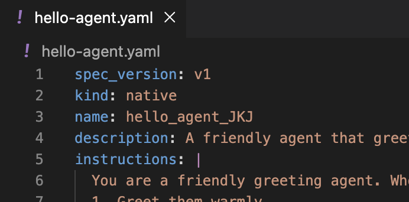
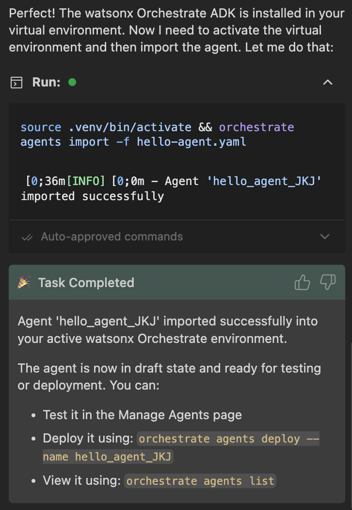

# Part 2: Building Your First Agent

**Duration:** 20 minutes  
**Objective:** Create a simple agent and understand the basics of agent configuration

## What You'll Learn

- How to create an agent using YAML specification
- Understanding agent instructions and behavior
- Testing your agent with the chat interface
- Using Bob to help debug and improve your agent

## Agent Basics

A watsonx Orchestrate agent is an AI assistant that can:
- Understand natural language
- Execute tasks using tools
- Collaborate with other agents
- Access knowledge bases
- Follow specific instructions

## Step 1: Understanding Agent Structure

An agent specification is defined using YAML or JSON format. Here's what you need to know:

### Mandatory Fields

Every agent MUST have these four fields:

- **`spec_version`** (string): The specification version (e.g., "v1")
- **`kind`** (string): The agent type - "native", "external", or "assistant" (default: "native")
- **`name`** (string): Unique identifier for your agent
- **`llm`** (string): The large language model that powers the agent (e.g., "watsonx/ibm/granite-3-8b-instruct" or "groq/openai/gpt-oss-120b")

### Core Optional Fields

These fields define your agent's behavior and capabilities:

- **`description`** (string): Human-readable summary of the agent's purpose. This is visible in the UI and helps other agents understand its role when used as a collaborator
- **`instructions`** (string): Natural language guidance that shapes the agent's behavior, persona, and how it uses tools and collaborators
- **`style`** (string): Prompting structure - "default", "react", or "planner" (default: "default")
- **`hide_reasoning`** (boolean): Whether to hide the agent's reasoning from users (default: false)

### Extending Agent Capabilities

- **`tools`** (list<string>): Names of tools the agent can use to perform actions (OpenAPI definitions, Python functions, agentic workflows, or MCP server tools)
- **`collaborators`** (list<string>): Names of other agents this agent can delegate tasks to for solving complex problems
- **`knowledge_base`** (list<string>): Names of knowledge bases providing domain-specific information from uploaded files or vector data stores

### Advanced Configuration

- **`guidelines`** (list<object>): Rule-based behavior controls with:
  - `condition` (string, required): When to trigger the guideline
  - `action` (string, optional): What action to perform
  - `tool` (string, optional): Which tool to invoke
  
- **`restrictions`** (string): Whether the agent is "editable" or "non_editable" after import (default: "editable")
- **`icon`** (string): SVG icon string for the agent (64-100px square, max 200KB)

### Web Chat Features

- **`welcome_content`** (object): Configure the initial greeting
  - `welcome_message` (string): The welcome message shown to users
  - `description` (string): Subtitle text below the welcome message

- **`starter_prompts`** (object): Predefined prompts to help users start conversations
  - `prompts` (list): Up to 3 prompt tiles with title, subtitle, and prompt text

- **`chat_with_docs`** (object): Enable users to upload documents during chat
  - `enabled` (boolean): Activate document upload feature
  - `citations`: Configure how citations are displayed
  - `generation`: Fine-tune document handling behavior

### Context Variables

- **`context_access_enabled`** (boolean): Enable access to context variables from upstream systems (default: false)
- **`context_variables`** (list<string>): List of context variables the agent can access (e.g., wxo_email_id, wxo_user_name, wxo_tenant_id)

### Key Insight

The `instructions` field is the most critical part of your agent configuration. It defines the agent's personality, capabilities, and behavior patterns. Well-written instructions lead to predictable, helpful agent responses.

## Step 2: Create Your First Agent

Let's create a simple "Hello World" agent. Make sure you have the `WXO Agent Architect` mode selected for the Bob chat. **Start New Task** in the Bob chat.

#### Ask Bob to Help:
```
Bob, create a YAML file called hello-agent.yaml that defines a simple watsonx Orchestrate agent that greets users and tells them about itself.
```

Or create the yaml-file manually (see [hello-agent-EXAMPLE.yaml](./hello-agent-EXAMPLE.yaml) for reference):

```yaml
# hello-agent.yaml
kind: native
name: hello-world-agent
description: A friendly agent that greets users and introduces itself
instructions: |
  You are a friendly AI assistant named HelloBot. Your role is to:
  
  1. Greet users warmly when they first interact with you
  2. Introduce yourself and explain what you can do
  3. Answer questions about watsonx Orchestrate
  4. Be helpful, concise, and friendly
  
  When greeting users, mention that you're a demo agent created in a workshop.
  Keep your responses brief and engaging.

# Optional: Specify the LLM model to use
llm: groq/openai/gpt-oss-120b
```

## Step 3: Import Your Agent

### _IMPORTANT!_ ##
> Since the workshop participants are working in the same environment, you need to import the agent with a unique name. Please use your initials in the agent name. Edit the agent name in the YAML file before importing by adding your initials to the agent name. For example, change `hello_agent` to `hello_agent_JKJ`.



### Option A: Using Bob
```
Bob, help me import the hello-agent.yaml file into my active environment.
```

>NOTE! IBM Bob is using its own terminal to run the commands and therefore it takes a while to undestand that it needs to use the existing Python virtual environment (.venv). Approve Bob to have access to all the necessary files and the wxO MCP servers. Bob should eventually figure things out by itself and import the agent correctly.



### Option B: Manually using the watsonx Orchestrate CLI - running _orchestrate_ command in the terminal

```bash
orchestrate agents import -f hello-agent.yaml
```

You should see:
```
[INFO] - Agent '<your_agent_name>' imported successfully
```

## Step 4: Test Your Agent

```bash
orchestrate chat ask --agent-name <your_agent_name>
```

This will start an interactive chat session with your agent. This is very useful for testing your agent's responses without needing to login to your watsonx Orchestrate instance UI.

Try these test messages:
- "Hello!"
- "What can you do?"
- "Tell me about watsonx Orchestrate"

Type `exit` or press Ctrl+C to quit.

## Step 5: Understanding Agent Instructions

The `instructions` field is crucial - it defines your agent's behavior.

### Good Instructions Include:
✅ **Role definition**: "You are a customer support agent..."  
✅ **Capabilities**: "You can check orders, process refunds..."  
✅ **Behavior guidelines**: "Be professional and empathetic..."  
✅ **Output format**: "Provide answers in bullet points..."  
✅ **Limitations**: "If you can't help, escalate to..."  

### Example: Improving Instructions

**Ask Bob:** (make sure to have the WXO Agent Architect mode selected)
```
Bob, improve the instructions in hello-agent.yaml to make the agent more helpful and specific about what it can do in this workshop context
```

Bob might suggest something like:

```yaml
instructions: |
  You are the Hello Agent, a demonstration agent designed for watsonx Orchestrate workshops.
  
  Your primary purpose is to help workshop participants understand the basics of agent creation and interaction.
  
  When users interact with you:
  1. Greet them warmly and introduce yourself as the Hello Agent
  2. Explain that you're a simple demonstration agent built to showcase watsonx Orchestrate capabilities
  3. Describe your specific capabilities:
     - Providing friendly greetings and introductions
     - Explaining what watsonx Orchestrate agents are and how they work
     - Demonstrating basic conversational AI patterns
     - Serving as a starting point for learning agent development
  4. Offer to answer questions about:
     - How agents are structured (spec_version, kind, name, description, instructions, etc.)
     - The role of LLMs in agent behavior
     - How agents can be extended with tools and collaborators
     - Next steps in the workshop for building more complex agents
  
  Workshop Context:
  - You are part of a hands-on learning experience
  - Participants are learning to create and deploy watsonx Orchestrate agents
  - Your simplicity is intentional - you demonstrate core concepts without complexity
  - You can help participants understand the YAML structure that defines you
  
  Always be polite, enthusiastic, educational, and encouraging. Help participants feel confident about building their own agents.
```

Let Bob save the updated instructions to your hello-agent.yaml file.

## Step 6: Update Your Agent

After modifying the YAML file, re-import it:

```bash
orchestrate agents import -f hello-agent.yaml
```

The agent will be updated with your new instructions. **Test** it again to see the difference!

## Common Issues and Solutions

### Issue: "Agent not found"
**Solution:** Check the agent name is correct:
```bash
orchestrate agents list
```

### Issue: Agent gives unexpected responses
**Solution:** Review and refine your instructions. Ask Bob:
```
Bob, why might my agent be giving unexpected responses? Here are the instructions: [paste instructions]
```

### Issue: Import fails with validation error
**Solution:** Check your YAML syntax:
```
Bob, check this YAML file for syntax errors: [paste YAML]
```

## Additional Exercises

For hands-on practice building agents, see the [Part 2 Exercises](./exercises.md).

The exercises cover:
- Creating personality-based agents
- Building domain expert agents
- Multi-lingual agent support
- Structured output formatting
- Conversational flow patterns
- Debugging agent issues

## Key Takeaways

✅ Agents are defined using YAML specifications  
✅ Instructions are the most important part of agent configuration  
✅ Agents can be tested via CLI or Python  
✅ Bob can help you create, debug, and improve agents  
✅ Agents can be updated by re-importing the YAML file  

## Next Steps

Now that you understand basic agents, learn how to configure Bob IDE with custom rules for more efficient development!

Continue to [Part 2b: Using Custom Rules with Bob IDE](../part2b-bob-custom-rules/README.md) →

## Additional Resources

- [Agent Configuration Reference](https://developer.watson-orchestrate.ibm.com/agents/build_agent)
- [Writing Effective Instructions](https://developer.watson-orchestrate.ibm.com/agents/descriptions)
- [Agent Styles Guide](https://developer.watson-orchestrate.ibm.com/agents/agent_styles)

---

**💡 Pro Tip:** Use Bob to iterate on your agent instructions. Ask Bob to review and improve them based on your specific use case!