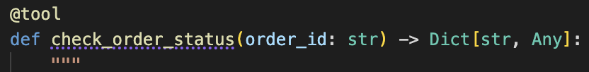
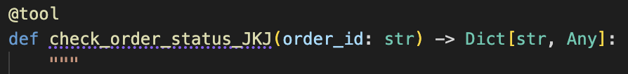

# Part 3: Adding Custom Tools

**Duration:** 30 minutes  

**Objective:** Create custom Python tools that your agents can use to perform actions

## What You'll Learn

- How to create Python tools for watsonx Orchestrate
- Tool structure and best practices
- Connecting tools to agents
- Using Bob to generate and debug tools

## Why Custom Tools?

Tools extend your agent's capabilities beyond conversation. They allow agents to:

- 🔍 Query databases and APIs
- 📊 Process and analyze data
- 📝 Create and modify files
- 🔧 Perform calculations and transformations
- 🌐 Integrate with external systems

## Tool Structure

A watsonx Orchestrate Python tool has this structure:

```python
from ibm_watsonx_orchestrate.agent_builder.tools import tool

@tool
def my_tool(param1: str) -> dict:
    """Tool description that helps the agent understand when to use it.
    
    Args:
        param1 (str): What this parameter is for
        
    Returns:
        dict: The result of the tool execution
    """
    # Your code here
    return {
        "result": "success",
        "data": "your result"
    }
```

**Alternative: Using the decorator's description parameter:**

```python
from ibm_watsonx_orchestrate.agent_builder.tools import tool

@tool(
    name="my_custom_tool",
    description="Tool description that helps the agent understand when to use it"
)
def my_tool(param1: str) -> dict:
    """
    Args:
        param1 (str): What this parameter is for
        
    Returns:
        dict: The result of the tool execution
    """
    # Your code here
    return {
        "result": "success",
        "data": "your result"
    }
```

**Key Points:**<br>
- Use the `@tool` decorator to define tools<br>
- Tool name defaults to the function name (or specify with `@tool(name="custom_name")`)<br>
- Description can be provided in two ways:<br>
  - **Via docstring** (recommended): Extracted from the function's docstring<br>
  - **Via decorator parameter**: Pass directly to the decorator as `@tool(description="Your description here")`<br>
- Parameter types and descriptions come from type hints and docstring Args section<br>
- Must use Google-style docstrings for proper parameter documentation when using docstring approach<br>
- The `@tool` decorator also accepts other optional parameters like `expect_credentials` for tools requiring authentication

> 📖 **Reference:** For complete details on the `@tool` decorator and its parameters, see the [Authoring Python-Based Tools](https://developer.watson-orchestrate.ibm.com/tools/create_tool#authoring-python-based-tools) documentation.

## Step 1: Create an Order Status Tool

Let's create a tool that checks order status (simulated for this workshop).

### Ask Bob:
```
Bob, create a Python tool for watsonx Orchestrate that checks order status. It should take an order_id parameter and return mock order information including status, items, and delivery date.
```

Or create it manually:

```python
# order_status_tool.py
from ibm_watsonx_orchestrate.agent_builder.tools import tool
from datetime import datetime, timedelta
import random

@tool
def check_order_status(order_id: str) -> dict:
    """
    Retrieves the current status and details of a customer order by order ID.
    Use this when customers ask about their order status, delivery date, or order details.
    
    Args:
        order_id (str): The unique order identifier (e.g., ORD-12345)
        
    Returns:
        dict: Dictionary with order details including status, items, dates, and tracking
    """
    # Validate order ID format
    if not order_id.startswith("ORD-"):
        return {
            "success": False,
            "error": "Invalid order ID format. Must start with 'ORD-'"
        }
    
    # Simulate order lookup
    statuses = ["Processing", "Shipped", "Out for Delivery", "Delivered"]
    status = random.choice(statuses)
    
    # Generate mock order data
    order_date = datetime.now() - timedelta(days=random.randint(1, 10))
    delivery_date = order_date + timedelta(days=random.randint(3, 7))
    
    items = [
        {"name": "Laptop", "quantity": 1, "price": 999.99},
        {"name": "Mouse", "quantity": 1, "price": 29.99},
        {"name": "Keyboard", "quantity": 1, "price": 79.99}
    ]
    
    total = sum(item["price"] * item["quantity"] for item in items)
    
    return {
        "success": True,
        "order_id": order_id,
        "status": status,
        "order_date": order_date.strftime("%Y-%m-%d"),
        "estimated_delivery": delivery_date.strftime("%Y-%m-%d"),
        "items": items,
        "total": f"${total:.2f}",
        "tracking_number": f"TRK{random.randint(100000, 999999)}"
    }
```

## Step 2: Create a Refund Processing Tool

Now let's create a tool that processes refund requests.

### Ask Bob:
```
Bob, create a Python tool that processes refund requests. It should take order_id, reason, and amount parameters, validate them, and return a refund confirmation.
```
An example what Bob might come up with:
```python
# refund_tool.py
from ibm_watsonx_orchestrate.agent_builder.tools import tool
from datetime import datetime
import random

@tool
def process_refund(order_id: str, reason: str, amount: float) -> dict:
    """
    Processes a refund request for a customer order.
    Use this when customers request refunds or returns.
    
    Args:
        order_id (str): The order ID to refund (format: ORD-XXXXX)
        reason (str): Reason for the refund request (must be at least 10 characters)
        amount (float): Refund amount in dollars (must be positive and under $10,000)
        
    Returns:
        dict: Refund confirmation details including refund ID, status, and processing time
    """
    # Validation
    if not order_id.startswith("ORD-"):
        return {
            "success": False,
            "error": "Invalid order ID format"
        }
    
    if amount <= 0:
        return {
            "success": False,
            "error": "Refund amount must be greater than 0"
        }
    
    if amount > 10000:
        return {
            "success": False,
            "error": "Refund amount exceeds maximum. Please contact manager.",
            "requires_approval": True
        }
    
    if not reason or len(reason) < 10:
        return {
            "success": False,
            "error": "Please provide a detailed reason (at least 10 characters)"
        }
    
    # Process refund (simulated)
    refund_id = f"REF-{random.randint(10000, 99999)}"
    processing_time = "3-5 business days"
    
    return {
        "success": True,
        "refund_id": refund_id,
        "order_id": order_id,
        "amount": f"${amount:.2f}",
        "reason": reason,
        "status": "Approved",
        "processing_time": processing_time,
        "refund_method": "Original payment method",
        "confirmation_date": datetime.now().strftime("%Y-%m-%d %H:%M:%S")
    }
```

>NOTE: You might see Bob ceating also tests for the tools and some tools related documentation. If this is the case, you're welcome to explore those files as well.

## Step 3: Import Your Tools

### IMPORTANT: Since the workshop participants will be using the same watsonx Orchestrate environment, RENAME your _tool names_ (function names) inside the tool python files by adding your initials as a postfix. ###

>For example, `def check_order_status` becomes `def check_order_status_JKJ`. Make sure to use the same postfix for all your tools.



⬇︎



Notice that now that Bob is uing the custom wxO development rule, the tools are stored in _**tools**_ directory.

Import the tools into watsonx Orchestrate:

```bash
orchestrate tools import -k python -f tools/check_order_status.py -r requirements.txt
orchestrate tools import -k python -f tools/process_refund.py -r requirements.txt
```

>NOTE: The name of the python files - when Bob generates them - might be different what is shown here. Use the file names as Bob created them for you.

If you see [WARNING] messages, it's okay. These are caused by a Langchain bug in doc string parsing.

Verify they were imported:
```
orchestrate tools list | grep -E "<your_initials>", for example: orchestrate tools list | grep -E "JKJ"
```

You should see your tools listed!

## Step 4: Create a Customer Support Agent with Tools

Now create an agent that uses these tools. You can use the definition below - it was also created by Bob.

1. Create a new file `customer-support-agent.yaml` in the `agents` directory of your workspace. The directory should have been created by Bob when it created the tools. If not, create it manually.
2. Copy the content below into the file and save it.


You can also create your own agent definition if you prefer.

### IMPORTANT: Make sure to change the tool names in the agent definition to match the names of the tools you imported! ALSO the postfix the name of the agent with your initials! ###

```yaml
# customer-support-agent.yaml
spec_version: v1
kind: native
name: customer_support_agent_<your_initials_here>
description: A customer support agent that can check orders and process refunds

instructions: |
  You are a helpful customer support agent for an e-commerce company.
  
  Your capabilities:
  - Check order status using the check_order_status tool
  - Process refund requests using the process_refund tool
  - Answer general customer service questions
  
  When a customer asks about their order:
  1. Ask for their order ID if they haven't provided it
  2. Use the check_order_status tool to get order details
  3. Present the information clearly and helpfully
  
  When processing refunds:
  1. Confirm the order ID
  2. Ask for the reason if not provided
  3. Confirm the refund amount
  4. Use the process_refund tool to process the request
  5. Provide the refund confirmation details
  
  Always be professional, empathetic, and helpful. If you encounter errors,
  explain them clearly and offer alternatives.

llm: groq/openai/gpt-oss-120b

# Specify which tools this agent can use
tools:
  - check_order_status_<your_initials_here>
  - process_refund_<your_initials_here>

```

Import the agent:
```bash
orchestrate agents import -f agents/customer-support-agent.yaml
```

## Step 5: Test Your Agent with Tools

Test the agent:

```bash
orchestrate chat ask -n customer_support_agent_<your_initials_here>
```

Try these test scenarios:

**Scenario 1: Check Order Status**
```
User: Can you check the status of order ORD-12345?
```

The agent should call the `check_order_status` tool and present the results.

**Scenario 2: Process Refund**
```
User: I need to request a refund for order ORD-12345
Agent: [asks for reason]
User: The product arrived damaged
Agent: [provides you with the refund amount / asks for confirmation]
User: $99.99
```

The agent should call the `process_refund` tool and provide confirmation.

**Scenario 3: Error Handling**
```
User: Check order status for ABC123
```

The agent should handle the invalid order ID gracefully.

## Step 6: Debug Tool Issues

If your tools aren't working, ask Bob for help:

```
Bob, my agent isn't calling the check_order_status tool. Here's the agent YAML and tool code: [paste code]
```

Common issues:<br>
- Tool name mismatch between agent YAML and tool definition<br>
- Missing or incorrect parameter descriptions<br>
- Tool not imported successfully<br>
- Agent instructions don't mention when to use the tool

## Best Practices for Tools

### ✅ DO:
- Provide clear, descriptive tool names
- Write detailed parameter descriptions
- Include input validation
- Return structured, consistent responses
- Handle errors gracefully
- Add helpful error messages

### ❌ DON'T:
- Use vague tool descriptions
- Skip parameter validation
- Return inconsistent response formats
- Ignore error cases
- Make tools do too many things (keep them focused)

## Advanced: Tools with External APIs

Tools can call real APIs. Here's an example structure:

```python
import requests
from ibm_watsonx_orchestrate.agent_builder.tools import PythonTool

class WeatherTool(PythonTool):
    """Get weather information"""
    
    def __init__(self):
        super().__init__(
            name="get_weather",
            description="Get current weather for a city",
            parameters={
                "city": {
                    "type": "string",
                    "description": "City name",
                    "required": True
                }
            },
            # Specify credentials needed
            expect_credentials={
                "api_key": "Weather API key"
            }
        )
    
    def run(self, city: str, credentials: dict = None) -> dict:
        """Get weather data"""
        api_key = credentials.get("api_key") if credentials else None
        
        if not api_key:
            return {"error": "API key not configured"}
        
        # Call external API
        response = requests.get(
            f"https://api.weather.com/v1/current",
            params={"city": city, "key": api_key}
        )
        
        return response.json()
```

## Exercises

Ready to practice? We've prepared a comprehensive set of exercises to help you master custom tool creation!

📝 **[View All Exercises](exercises.md)** - Complete exercises ranging from easy to advanced

We strongly recommend working through at least a few of these exercises before moving forward with the workshop. They'll help solidify your understanding of:<br>
- Tool structure and best practices<br>
- Input validation and error handling<br>
- Creating tools that agents can effectively use<br>
- Debugging common tool issues

The exercises include detailed requirements, test cases, and success criteria to guide your learning.

## Key Takeaways

✅ Tools extend agent capabilities with custom logic  
✅ Tools have clear names, descriptions, and parameters  
✅ Agents must list tools they can use in their YAML  
✅ Tools should validate inputs and handle errors  
✅ Bob can help generate, debug, and improve tools  

## Next Steps

Now that your agent has tools, let's explore how to use different AI models!

Continue to [Part 3b: AI Gateway and Using Different Models](../part3b-ai-gateway-models/README.md) →

## Additional Resources

- [Python Tools Guide](https://developer.watson-orchestrate.ibm.com/tools/create_tool)
- [Managing Tools](https://developer.watson-orchestrate.ibm.com/tools/manage_tool)
- [Associating Connections to Python Tools](https://developer.watson-orchestrate.ibm.com/connections/associate_connection_to_tool/python_connections)

---

**💡 Pro Tip:** Use Bob to generate tool templates and then customize them for your specific needs!