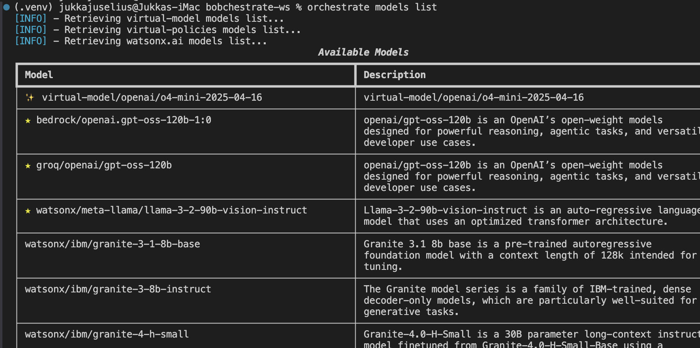

# Part 3b: AI Gateway and External Model Providers

**Duration:** 25 minutes
**Objective:** Learn how to configure external AI models through watsonx Orchestrate's AI Gateway and implement model policies

> 📋 **Quick Reference:** Check out the [Model Selection Guide](model-selection-guide.md) for a quick reference on AI Gateway capabilities!

## What You'll Learn

- Understanding the AI Gateway architecture
- How to connect external LLM providers
- Configuring model policies for governance
- Managing model access and usage
- Testing agents with external models
- Best practices for model management

## Why AI Gateway Matters

The AI Gateway in watsonx Orchestrate provides:
- 🔌 **Unified Interface** - Access multiple LLM providers through a single API
- 🌐 **External Provider Support** - Connect to OpenAI, Anthropic, Google, AWS Bedrock, Azure, and more
- 🔄 **Model Flexibility** - Switch between models without changing agent code
- 🛡️ **Governance & Policies** - Centralized control over model access, usage limits, and compliance
- 💰 **Cost Management** - Track and control model usage and costs
- 📊 **Monitoring** - Comprehensive visibility into model performance and usage patterns

## Available Model Options

watsonx Orchestrate supports models through two main approaches:

### Default Platform Models

The platform includes a default model that is optimized and validated:

- **groq/openai/gpt-oss-120b** ⭐ - High-performance model optimized for speed, tool calling, and multilingual support
  - Available from Groq (ultra-fast inference)
  - Also available from AWS Bedrock (enterprise-grade reliability)

### External Models via AI Gateway

You can connect to external model providers through the AI Gateway:

| Provider | Example Models | Use Cases |
|----------|---------------|-----------|
| **OpenAI** | GPT-4, GPT-4-turbo, GPT-3.5-turbo | General purpose, advanced reasoning |
| **Anthropic** | Claude 3 Opus, Sonnet, Haiku | Long context, analysis, coding |
| **Google** | Gemini Pro, Gemini Flash | Multimodal, fast inference |
| **AWS Bedrock** | Various foundation models | Enterprise deployment, compliance |
| **Azure OpenAI** | Azure-hosted OpenAI models | Microsoft ecosystem integration |
| **Ollama** | Locally hosted models | On-premises, data privacy |

> **Note:** External models require proper configuration through the AI Gateway and may incur additional costs from the provider.

## Step 1: Understanding AI Gateway Architecture

The AI Gateway acts as a unified interface between your agents and various LLM providers:

```
┌────────────────────────────────────────────────────┐
│             watsonx Orchestrate                    │
│                                                    │
│  ┌──────────┐  ┌──────────┐  ┌──────────┐          │
│  │ Agent A  │  │ Agent B  │  │ Agent C  │          │
│  └────┬─────┘  └────┬─────┘  └────┬─────┘          │
│       │             │             │                │
│       └─────────────┴─────────────┘                │
│                     │                              │
│              ┌──────▼──────┐                       │
│              │ AI Gateway  │                       │
│              │  + Policies │                       │
│              └──────┬──────┘                       │
│                     │                              │
└─────────────────────┼──────────────────────────────┘
                      │
        ┌─────────────┼─────────────┐
        │             │             │
   ┌────▼────┐   ┌───▼─────┐   ┌───▼────┐
   │ OpenAI  │   │Anthropic│   │ Google │
   └─────────┘   └─────────┘   └────────┘
```

### Key Capabilities

1. **Provider Abstraction** - Agents don't need to know which provider they're using
2. **Policy Enforcement** - Centralized governance and compliance
3. **Usage Tracking** - Monitor costs and performance across all models
4. **Failover Support** - Automatic fallback to alternative providers
5. **Rate Limiting** - Control usage to manage costs

## Step 2: Configuring External Model Providers

### Adding an External Provider

To add an external model provider, you'll need to configure it through the AI Gateway:

```bash
# List currently available models
orchestrate models list

# Manage model policies
orchestrate models policy [import|export|add|remove] -n (model_policy_name) -m (model_name) -s (strategy)
```

### Example: Connecting to OpenAI

```yaml
# ai-gateway-config.yaml
providers:
  - name: openai
    type: openai
    api_key: ${OPENAI_API_KEY}  # Use environment variable
    models:
      - gpt-4
      - gpt-4-turbo
      - gpt-3.5-turbo
    default_model: gpt-4-turbo
```

### Example: Connecting to Anthropic

```yaml
# ai-gateway-config.yaml
providers:
  - name: anthropic
    type: anthropic
    api_key: ${ANTHROPIC_API_KEY}
    models:
      - claude-3-opus-20240229
      - claude-3-sonnet-20240229
      - claude-3-haiku-20240307
    default_model: claude-3-sonnet-20240229
```

## Step 3: Implementing Model Policies

Model policies allow you to coordinate multiple models for load balancing, fallback, and retry strategies.

### Policy Strategy Types

1. **Load Balancing** - Distribute requests across multiple model instances
2. **Fallback** - Automatically switch to backup models on errors
3. **Single with Retry** - Retry failed requests on the same model

### Creating Model Policies

#### Load Balancing Policy

Distributes traffic across multiple models based on weight:

```yaml
# load-balance-policy.yaml
spec_version: v1
kind: model
name: balanced_gpt
description: Load balances between Groq and AWS Bedrock
display_name: Balanced GPT

policy:
  strategy:
    mode: loadbalance
    on_status_codes: [503, 504]
  retry:
    attempts: 1
  targets:
    - model_name: groq/openai/gpt-oss-120b
      weight: 0.75   # 75% of traffic
    - model_name: aws-bedrock/gpt-oss-120b
      weight: 0.25   # 25% of traffic
```

#### Fallback Policy

Automatically switches to backup model on errors:

```yaml
# fallback-policy.yaml
spec_version: v1
kind: model
name: resilient_gpt
description: Falls back to AWS Bedrock if Groq fails
display_name: Resilient GPT

policy:
  strategy:
    mode: fallback
  retry:
    attempts: 1
    on_status_codes: [503, 500]
  targets:
    - model_name: groq/openai/gpt-oss-120b
    - model_name: aws-bedrock/gpt-oss-120b
```

#### Single Model with Retry

Retries on the same model for transient errors:

```yaml
# retry-policy.yaml
spec_version: v1
kind: model
name: retry_gpt
description: Retries up to 3 times on transient errors
display_name: Retry GPT

policy:
  strategy:
    mode: single
  retry:
    attempts: 3
    on_status_codes: [503]
  targets:
    - model_name: groq/openai/gpt-oss-120b
```

### Managing Model Policies

```bash
# Add a policy via CLI
orchestrate models policy add \
  --name resilient_gpt \
  --model groq/openai/gpt-oss-120b \
  --model aws-bedrock/gpt-oss-120b \
  --strategy fallback \
  --strategy-on-code 503 \
  --retry-attempts 2

# Import from YAML file
orchestrate models policy import --file fallback-policy.yaml

# List all policies
orchestrate models policy list

# Export a policy
orchestrate models policy export -n resilient_gpt -o policy.zip

# Remove a policy
orchestrate models policy remove -n resilient_gpt
```

### Applying Policies to Agents

Once created, reference the policy name in your agent's `llm` field:

```yaml
# agent-with-policy.yaml
spec_version: v1
kind: native
name: resilient_support_agent
description: Support agent with automatic fallback

instructions: |
  You are a customer support agent providing helpful, efficient responses.

# Reference the policy name (not a direct model)
llm: resilient_gpt

tools:
  - check_order_status
  - process_refund
```

## Step 4: Create a Support Agent with External Model

Let's create a customer support agent that can use external models:

📥 **[Download Agent](agents/support-agent-standard.yaml)** | Place it into `agents/` directory of your workspace

```yaml
spec_version: v1
kind: native
name: support_agent_<your_initials_here>
description: Customer support agent using default platform model

instructions: |
  You are a customer support agent providing helpful, efficient responses.
  
  Your approach:
  - Understand customer needs quickly
  - Provide clear, actionable guidance
  - Show empathy and professionalism
  - Handle multi-step requests efficiently
  - Use tools effectively for order and refund management
  
  Balance speed with quality service.

# Using the default platform model
llm: groq/openai/gpt-oss-120b

tools:
  - check_order_status_<your_initials_here>
  - process_refund_<your_initials_here>
```

### IMPORTANT: Replace `<your_initials_here>` with your actual initials in all references inside the agent yaml-file you downloaded - Agent _name_ and the _tool references_. Make sure that the tools are correctly referenced in the YAML file, your tool files might be named differently. Use the tools you created and imported in the previous part.

## Step 5: Import and Test the Agent

Before you begin, check the models available in your environment:

```bash
orchestrate models list
```



Import the agent:

```bash
orchestrate agents import -f agents/support-agent-standard.yaml
```

Verify it was imported:
```bash
orchestrate agents list | grep -E "<your_initials>"
```

## Step 6: Test with Different Scenarios

Test your agent with various scenarios:

### Test Scenario 1: Simple Query

```
What's your return policy?
```

> REMINDER: You can chat with the agent using the `orchestrate chat ask -n <agent_name>` command.

### Test Scenario 2: Complex Situation

```
I ordered a laptop 3 weeks ago (ORD-12345), it arrived damaged, I need it for work tomorrow, and I'm very frustrated. What can you do?
```

### Test Scenario 3: Multi-Step Request

```
I need to check my order status, and if it hasn't shipped yet, I want to change the shipping address and upgrade to express shipping.
```

## Step 7: Monitoring and Governance

### Viewing Model Usage

```bash
# View model usage statistics
orchestrate gateway usage --period 7d

# View policy violations
orchestrate gateway policy-violations --period 24h

# View cost breakdown
orchestrate gateway costs --group-by model
```

### Setting Up Alerts

```yaml
# alerts-config.yaml
alerts:
  - name: high_cost_alert
    condition: daily_cost > 100
    action: email
    recipients:
      - admin@company.com
  
  - name: rate_limit_alert
    condition: rate_limit_exceeded
    action: slack
    channel: "#ai-ops"
  
  - name: policy_violation_alert
    condition: policy_violation
    action: pagerduty
    severity: high
```

## Best Practices

### ✅ DO:

- **Start with default models** - Use groq/openai/gpt-oss-120b for most use cases
- **Implement policies early** - Set up governance before scaling
- **Monitor usage closely** - Track costs and performance regularly
- **Use environment variables** - Never hardcode API keys
- **Test external models** - Validate behavior before production use
- **Document model choices** - Record why specific models were selected
- **Set up alerts** - Get notified of issues before they become problems
- **Review policies regularly** - Adjust as usage patterns change

### ❌ DON'T:

- **Expose API keys** - Always use secure credential management
- **Skip policy configuration** - Governance is critical for production
- **Ignore cost monitoring** - External models can be expensive
- **Use untested models** - Always validate before production deployment
- **Forget about compliance** - Consider data residency and privacy requirements
- **Overlook rate limits** - Plan for provider limitations
- **Mix environments** - Keep development and production configurations separate

## Advanced: Multi-Provider Strategy

You can design agents that leverage multiple providers for resilience:

```yaml
# multi-provider-agent.yaml
spec_version: v1
kind: native
name: resilient_agent_<your_initials_here>
description: Agent with multi-provider fallback strategy

instructions: |
  You are a customer support agent with high availability requirements.

# Primary model
llm: groq/openai/gpt-oss-120b

# Fallback configuration (conceptual - check current platform capabilities)
fallback:
  - provider: aws-bedrock
    model: gpt-oss-120b
  - provider: openai
    model: gpt-4-turbo

policy: high_availability_policy

tools:
  - check_order_status_<your_initials_here>
  - process_refund_<your_initials_here>
```

## Exercises

Ready to practice? We've prepared comprehensive exercises to help you master AI Gateway and model policies!

📝 **[View All Exercises](exercises.md)** - Complete exercises ranging from easy to advanced

The exercises cover:
- Configuring external model providers
- Implementing model policies
- Cost optimization strategies
- Multi-provider architectures
- Monitoring and governance
- Compliance and security

We recommend working through at least the first 2-3 exercises to solidify your understanding before moving to the next part.

## Common Issues

### Issue: External model not available
**Solution:** Verify provider configuration and API key. Check:
```bash
orchestrate gateway providers list
orchestrate gateway test-connection --provider openai
```

### Issue: Policy violation errors
**Solution:** Review policy configuration and adjust limits or allowed models.

### Issue: High costs
**Solution:** Implement stricter policies, use rate limiting, or switch to more cost-effective models.

### Issue: Slow responses
**Solution:** Check provider status, consider using faster models, or implement caching.

## Key Takeaways

✅ AI Gateway provides unified access to multiple model providers  
✅ Model policies enable governance and cost control  
✅ External models offer flexibility but require careful management  
✅ Monitoring and alerts are essential for production use  
✅ Start with default models and add external providers as needed  
✅ Security and compliance must be built in from the start  

## Next Steps

Now that you understand AI Gateway and model policies, let's add knowledge bases and collaborators!

Continue to [Part 4: Knowledge Bases & Collaborators](../part4-knowledge/README.md) →

## Additional Resources

- [watsonx Orchestrate AI Gateway Documentation](https://developer.watson-orchestrate.ibm.com/llm/managing_llm)
- [Model Policies Guide](https://developer.watson-orchestrate.ibm.com/llm/policies)
- [External Provider Configuration](https://developer.watson-orchestrate.ibm.com/llm/providers)
- [Cost Optimization Strategies](https://developer.watson-orchestrate.ibm.com/llm/cost_optimization)

---

**💡 Pro Tip:** Start with the default groq/openai/gpt-oss-120b model and only add external providers when you have specific requirements that the default model cannot meet!