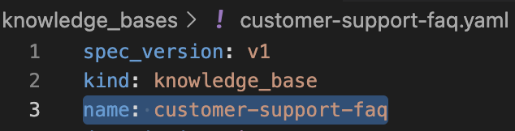
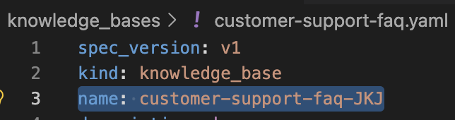
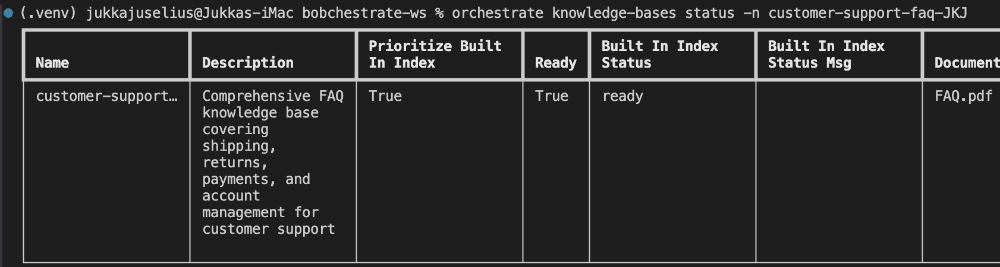
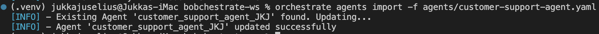

# Part 4: Knowledge Bases & Collaborators

**Duration:** 25 minutes

**Objective:** Add knowledge bases for FAQ handling and create specialized collaborator agents

> **Note:** This part builds on the agents you created in [Part 3: Custom Tools](../part3-custom-tools/README.md).

## What You'll Learn

- How to create and configure knowledge bases
- Connecting knowledge bases to agents
- Creating specialized collaborator agents
- Building agent hierarchies for complex workflows

## Knowledge Bases Overview

Knowledge bases allow agents to:

- 📚 Access large amounts of information without including it in instructions
- 🔍 Retrieve relevant information based on user queries
- 📝 Answer questions from documents, FAQs, and knowledge articles
- 🎯 Provide accurate, sourced responses

## Step 1: Create a Knowledge Base

Let's create a simple FAQ knowledge base for our customer support agent. Choose one of the following options:

### Option A: Manual YAML Creation

Create FAQ content using the example provided below or create your own using Bob! Bob prompt provided after the example.

```yaml
# customer-suport-faq.yaml
kind: knowledge_base
name: customer-support-faq
description: Frequently asked questions for customer support

documents:
  - title: "Shipping Policy"
    content: |
      # Shipping Policy
      
      ## Domestic Shipping
      - Standard shipping: 5-7 business days ($5.99)
      - Express shipping: 2-3 business days ($12.99)
      - Overnight shipping: 1 business day ($24.99)
      
      ## International Shipping
      - International standard: 10-15 business days ($19.99)
      - International express: 5-7 business days ($39.99)
      
      ## Free Shipping
      Orders over $50 qualify for free standard shipping within the US.
      
  - title: "Return Policy"
    content: |
      # Return Policy
      
      ## Return Window
      You can return most items within 30 days of delivery for a full refund.
      
      ## Return Process
      1. Contact customer support to initiate a return
      2. Receive a return authorization number
      3. Ship the item back using the provided label
      4. Refund processed within 5-7 business days after receipt
      
      ## Non-Returnable Items
      - Opened software or digital products
      - Personalized items
      - Gift cards
      
  - title: "Payment Methods"
    content: |
      # Payment Methods
      
      We accept:
      - Credit cards (Visa, MasterCard, American Express, Discover)
      - Debit cards
      - PayPal
      - Apple Pay
      - Google Pay
      
      ## Payment Security
      All transactions are encrypted and secure. We never store your full
      credit card information.
      
  - title: "Account Management"
    content: |
      # Account Management
      
      ## Creating an Account
      Click "Sign Up" and provide your email and password.
      
      ## Resetting Password
      Click "Forgot Password" on the login page and follow the email instructions.
      
      ## Updating Profile
      Go to Account Settings to update your name, email, address, and preferences.
      
      ## Deleting Account
      Contact customer support to request account deletion. This process takes
      3-5 business days.

```

#### Ask Bob to Help:
```
Bob, create a knowledge base YAML file with FAQs about shipping, returns, payments, and account management
```

### Option B: Import PDF with Bob's Help

Use Bob to create a knowledge base YAML file to import the FAQ PDF.

1. **Download the FAQ PDF**:
   - **Direct download**: [FAQ.pdf](./FAQ.pdf)
   
   The FAQ.pdf contains comprehensive FAQs about:
   - Shipping Information
   - Returns and Refunds
   - Payment Methods and Billing
   - Account Management
   - Order Management
   - Customer Support

2. **Place the PDF in the `knowledge_bases` directory in your workspace.**

3. **Ask Bob to create the knowledge base**:
   ```
   Bob, create a knowledge base yaml-file to import the FAQ.pdf in the knowledge_bases directory as a knowledge to watsonx Orchestrate. The yaml-file should be called "customer-support-faq.yaml".
   ```

4. **What Bob will do**:
   - Verify that the FAQ.pdf file exists in the knowledge_bases directory
   - Create a properly formatted knowledge base YAML file to import the PDF as a knowledge base
   - Structure it for optimal retrieval in watsonx Orchestrate

5. **Expected output**: Bob will create a `customer-support-faq.yaml` file with the PDF content ready for import into watsonx Orchestrate.

**💡 Pro Tip:** Option B is ideal when you have existing documentation in PDF format. Bob can help you quickly convert it into a knowledge base without manual copying and formatting!

#### Knowledge Base Naming Guidelines

When naming your knowledge base, follow these best practices:

- Use lowercase letters, numbers, and hyphens (e.g., `customer-support-faq`)
- Keep names descriptive and meaningful
- Avoid spaces (use hyphens instead)
- Use consistent naming conventions across your project
- Example good names: `product-catalog`, `technical-docs`, `company-policies`

## Step 2: Import the Knowledge Base

## IMPORTANT: Since the workshop participants will be using the same watsonx Orchestrate environment, RENAME your _knowledge-base_ in the yaml-file by adding your initials as a postfix. ###

For example, `name: customer-support-faq` becomes `name: customer-support-faq-JKJ`.



⬇︎



Import your knowledge base:

```bash
orchestrate knowledge-bases import -f knowledge_bases/customer-support-faq.yaml
```

Check the status:
```bash
orchestrate knowledge-bases list
orchestrate knowledge-bases status -n customer-support-faq-<your_initials_here>
```



Wait for the knowledge base to be indexed (status: "ready").

## Step 3: Connect Knowledge Base to Agent

Update your _**customer support agent**_ to use the knowledge base. **Add the "knowledge_base" field to your agent configuration.**

>**NOTE**: The example below might be a bit different what you have as your customer support agent, but the main things is to add the "knowledge_base" field to your agent configuration.

```yaml
# customer-support-agent.yaml
spec_version: v1
kind: native
name: customer_support_agent_<your_initials_here>
style: default
hide_reasoning: true
description: A customer support agent that can check orders, process refunds, and answer FAQs

instructions: |
  You are a helpful customer support agent for an e-commerce company.
  
  Your capabilities:
  - Check order status using the check_order_status tool
  - Process refund requests using the process_refund tool
  - Answer questions using the customer-support-faq knowledge base
  
  When answering questions:
  1. First check if the information is in your knowledge base
  2. Provide accurate, helpful answers based on the knowledge base
  3. If the information isn't available, politely say so and offer to escalate
  
  When handling orders and refunds:
  1. Use the appropriate tools
  2. Present information clearly
  3. Be empathetic and professional
  
  Always prioritize customer satisfaction while following company policies.

llm: groq/openai/gpt-oss-120b

# Tools this agent can use
tools:
  - check_order_status_<your_initials_here>
  - process_refund_<your_initials_here>

# Knowledge bases this agent can access
knowledge_base:
  - customer-support-faq-<your_initials_here>

```

Re-import the agent:
```bash
orchestrate agents import -f agents/customer-support-agent.yaml
```



## Step 4: Test Knowledge Base Integration

Test the agent with FAQ questions:

```bash
orchestrate chat ask -n customer_support_agent_<your_initials_here>
```

Try these questions:

- "What's your shipping policy?"
- "What payment methods do you accept?"
- "How long does standard shipping take?"
- "Do you accept returns?"

The agent should retrieve and present information from the knowledge base!

## Step 5: Create a Specialized Escalation Agent

Now let's create a specialized agent for handling complex issues. Use the example below as a template and store it in `agents/escalation-agent.yaml`.

**AGAIN**, remember to replace `<your_initials_here>` with your actual initials in all file names and references!

```yaml
# escalation-agent.yaml
spec_version: v1
kind: native
name: escalation_agent_<your_initials_here>
style: default
hide_reasoning: true
description: Handles complex customer issues that require manager approval or special handling

instructions: |
  You are a senior customer support specialist who handles escalated issues.
  
  Your role:
  - Handle complex refund requests over $10,000
  - Resolve customer complaints
  - Make exceptions to standard policies when appropriate
  - Provide detailed investigation of issues
  
  When handling escalations:
  1. Acknowledge the customer's frustration
  2. Gather all relevant details
  3. Explain what you can do to help
  4. Provide clear next steps and timelines
  5. Follow up to ensure resolution
  
  You have authority to:
  - Approve refunds up to $25,000
  - Offer compensation (discounts, credits)
  - Override standard policies in exceptional cases
  - Expedite shipping at no charge
  
  Always document your decisions and reasoning. Be empathetic but maintain
  professional boundaries.

llm: groq/openai/gpt-oss-120b

# This agent can use the same tools
tools:
  - check_order_status_<your_initials_here>
  - process_refund_<your_initials_here>

# And access the same knowledge base
knowledge_base:
  - customer-support-faq-<your_initials_here>

```

Import the escalation agent:
```bash
orchestrate agents import -f agents/escalation-agent.yaml
```

## Step 6: Create Agent Collaboration

Update the main customer support agent to collaborate with the escalation agent:

```yaml
# customer-support-agent.yaml (updated)
spec_version: v1
kind: native
name: customer_support_agent_<your_initials_here>
style: default
hide_reasoning: true
description: A customer support agent that can check orders, process refunds, and answer FAQs

instructions: |
  You are a helpful customer support agent for an e-commerce company.
  
  Your capabilities:
  - Check order status using the check_order_status tool
  - Process refund requests using the process_refund tool (up to $10,000)
  - Answer questions using the customer-support-faq knowledge base
  - Escalate complex issues to the escalation-agent
  
  When to escalate to escalation-agent:
  - Refund requests over $10,000
  - Customer is very upset or threatening legal action
  - Request requires policy exception
  - Issue is beyond your authority
  - Customer specifically requests a manager
  
  When escalating:
  1. Explain to the customer that you're connecting them with a specialist
  2. Summarize the issue for the escalation agent
  3. Let the escalation agent take over
  
  For routine matters, handle them yourself efficiently and professionally.

llm: groq/openai/gpt-oss-120b

tools:
  - check_order_status_<your_initials_here>
  - process_refund_<your_initials_here>

knowledge_base:
  - customer-support-faq-<your_initials_here>

# Add the escalation agent as a collaborator
collaborators:
  - escalation_agent_<your_initials_here>

```

***The important parts:***

- Add escalation_agent_<your_initials_here> to collaborators
- Add instructions about when to escalate under your customer support agent's instructions

```
When to escalate to escalation_agent_<your_initials_here>:
  - Refund requests over $10,000
  - Customer is very upset or threatening legal action
  - Request requires policy exception
  - Issue is beyond your authority
  - Customer specifically requests a manager
  
  When escalating:
  1. Explain to the customer that you're connecting them with a specialist
  2. Summarize the issue for the escalation agent
  3. Let the escalation agent take over
  
  For routine matters, handle them yourself efficiently and professionally.
```

Re-import:
```bash
orchestrate agents import -f agents/customer-support-agent.yaml
```

## Step 7: Test Agent Collaboration

Test the collaboration:

```bash
orchestrate chat ask -n customer_support_agent_<your_initials_here>
```

Try these scenarios:

**Scenario 1: Routine Question (handled by main agent)**
```
User: What's your return policy?
```

**Scenario 2: Standard Refund (handled by main agent)**
```
User: I need a refund for order ORD-12345. The item was damaged. Amount is $99.99.
```

**Scenario 3: Large Refund (escalated)**
```
User: I need a refund for order ORD-67890. The entire shipment was wrong. Amount is $15,000.
```
```
User: This is very unprofessional service. I'm considering legal action. I need to be refunded NOW!
```

The agent should recognize this needs escalation and delegate to the escalation-agent!

## Step 8: Advanced Knowledge Base Features

### Multiple Knowledge Bases

You can create specialized knowledge bases:

```yaml
# technical-kb.yaml
kind: knowledge_base
name: technical-support-kb
description: Technical troubleshooting guides

documents:
  - title: "Device Setup"
    content: |
      # Device Setup Guide
      [Technical content here]
      
  - title: "Troubleshooting"
    content: |
      # Common Issues
      [Troubleshooting steps here]
```

Then assign different knowledge bases to different agents. _**Multiple agents can access the same knowledge base or each can have their own.**_

```yaml
# technical-support-agent.yaml
knowledge_base:
  - technical-support-kb
  - customer-support-faq  # Can access multiple KBs
```

## Best Practices

### Knowledge Base Best Practices

✅ **DO:**
- Organize content into clear, focused documents
- Use descriptive titles
- Include relevant keywords
- Keep documents updated
- Test retrieval with common queries

❌ **DON'T:**
- Create overly large documents
- Mix unrelated topics in one document
- Use vague titles
- Include outdated information
- Forget to re-index after updates

### Collaboration Best Practices

✅ **DO:**
- Define clear escalation criteria
- Provide context when delegating
- Create specialized agents for specific domains
- Test collaboration flows thoroughly
- Document agent responsibilities

❌ **DON'T:**
- Create circular delegation loops
- Make escalation criteria too vague
- Give all agents the same capabilities
- Forget to handle delegation failures
- Create too many layers of agents

## Common Issues

### Issue: Knowledge base not returning relevant results
**Solution:**<br>
- Check document titles and content<br>
- Verify knowledge base is indexed (status: "ready")<br>
- Try rephrasing the query<br>
- Adjust chunk_size and chunk_overlap

### Issue: Agent not delegating to collaborator
**Solution:**<br>
- Check collaborator is listed in agent YAML<br>
- Review escalation criteria in instructions<br>
- Verify collaborator agent exists<br>
- Test with clear escalation scenarios

### Issue: Collaborator agent not accessible
**Solution:**
```bash
orchestrate agents list | grep -E "your_initials"
# Verify both agents are imported
```

## Optional exercises

### Exercise 1: Product Catalog Knowledge Base
Create a knowledge base with product information and connect it to a sales agent.

**Ask Bob:**
```
Bob, create a product catalog knowledge base with 5 products and a sales agent that uses it
```

### Exercise 2: Multi-Agent System
Create a system with 3 agents: front-line support, technical support, and billing support.

**Ask Bob:**
```
Bob, design a multi-agent customer service system with specialized agents for different departments
```

### Exercise 3: Knowledge Base Optimization
Improve the FAQ knowledge base by adding more detailed content and better organization.

**Ask Bob:**
```
Bob, review my knowledge base and suggest improvements for better retrieval
```

## Key Takeaways

✅ Knowledge bases provide agents with access to large information sources  
✅ Agents can collaborate by delegating to specialized agents  
✅ Clear escalation criteria are essential for effective collaboration  
✅ Multiple knowledge bases can be used for different domains  
✅ Bob can help design and optimize agent hierarchies  

## Next Steps

You've built a complete customer support system! Now let's test and deploy it.

Continue to [Part 5: Agent guidelines and guardrails](../part5-guidelines-guardrails/README.md) →

## Additional Resources

- [Knowledge Base Guide](https://developer.watson-orchestrate.ibm.com/knowledge_base/build_kb)
- [Agent Collaboration Patterns](https://developer.watson-orchestrate.ibm.com/agents/overview)
- [Best Practices for Multi-Agent Systems](https://developer.watson-orchestrate.ibm.com/agents/descriptions)

---

**💡 Pro Tip:** Use Bob to help design your agent hierarchy. Ask: "Bob, design an agent system for [your use case]"