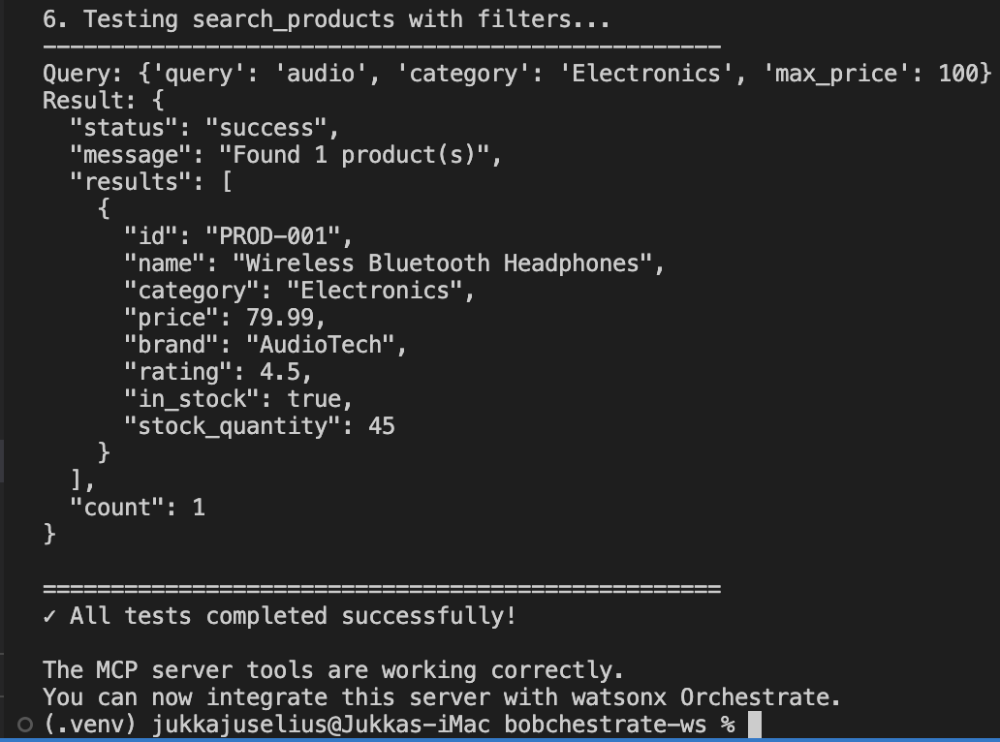
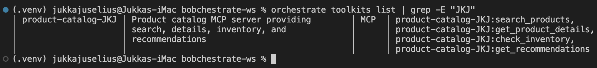
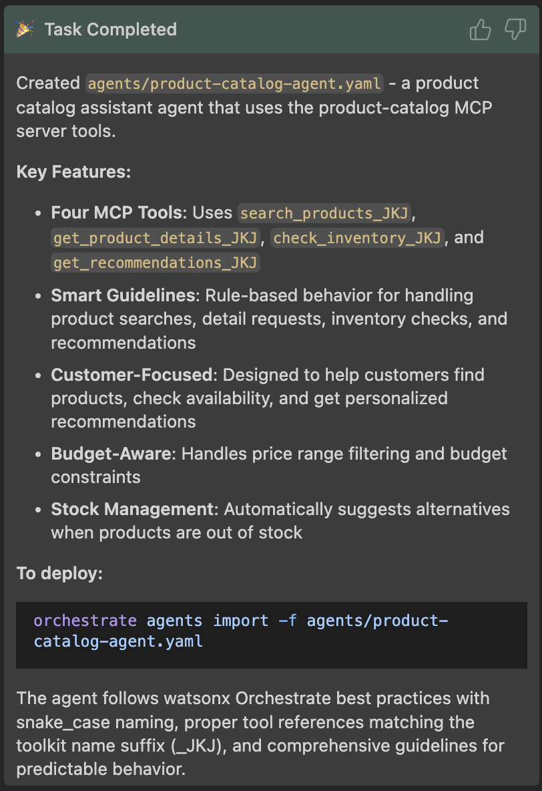

# Part 6: MCP Servers - Connecting to Backend Services

<p align="center">
  
</p>

**Duration**: 25 minutes

**Difficulty**: Intermediate

## Overview

In this lesson, you'll learn how to create and use **MCP (Model Context Protocol) servers** to connect your watsonx Orchestrate agents to backend services. MCP servers provide a standardized way to expose multiple tools and resources that agents can use.

### What You'll Learn

- What MCP servers are and why they're useful
- How to create a simple MCP server in Python
- How to import MCP servers into watsonx Orchestrate
- How to use MCP server tools in your agents
- Best practices for MCP server development

### What You'll Build

A **Product Catalog MCP Server** that provides tools for:

- Searching products
- Getting product details
- Checking inventory
- Getting product recommendations

Then you'll connect this MCP server to an agent that can help customers browse and find products.

---

## What are MCP Servers?

**MCP (Model Context Protocol)** is a standardized protocol for connecting AI agents to external tools and data sources. Think of it as a "toolkit" that packages multiple related tools together.

### Why Use MCP Servers?

**Benefits:**

- 📦 **Package related tools together** - Group tools by domain (e.g., all product-related tools)
- 🔄 **Reusable across agents** - One MCP server can serve multiple agents
- 🔌 **Easy integration** - Standard protocol makes connection simple
- 🛡️ **Centralized logic** - Backend logic stays in one place
- 🚀 **Scalable** - Can run locally or remotely

**When to Use MCP Servers vs Individual Tools:**

| Use MCP Server When... | Use Individual Tools When... |
|------------------------|------------------------------|
| You have 3+ related tools | You have 1-2 simple tools |
| Tools share backend logic | Tools are independent |
| You want to reuse across agents | Tool is agent-specific |
| You need centralized updates | Tool logic is simple |

---

## Part 1: Creating Your First MCP Server

### Step 1: Understanding MCP Server Structure

An MCP server in Python has this basic structure:

```python
from mcp.server import Server
from mcp.server.stdio import stdio_server
from mcp.types import Tool, TextContent

# Create server instance
app = Server("my-server")

# Define tools using @app.list_tools()
@app.list_tools()
async def list_tools() -> list[Tool]:
    return [
        Tool(
            name="tool_name",
            description="What the tool does",
            inputSchema={
                "type": "object",
                "properties": {
                    "param": {"type": "string"}
                },
                "required": ["param"]
            }
        )
    ]

# Implement tool logic using @app.call_tool()
@app.call_tool()
async def call_tool(name: str, arguments: dict) -> list[TextContent]:
    if name == "tool_name":
        result = do_something(arguments["param"])
        return [TextContent(type="text", text=result)]

# Run the server
if __name__ == "__main__":
    import asyncio
    asyncio.run(stdio_server(app))
```

### Step 2: Create the Product Catalog MCP Server

Let's build a complete MCP server for product catalog operations.

>**NOTE**: You can switch your Bob chat to **Code** mode for this.

**💡 Ask Bob to help:**
```
Bob, create a file called product_catalog_server.py with an MCP server 
that provides tools for searching products, getting product details, 
checking inventory, and getting recommendations. Use mock data for now.
```

Or create it yourself:

```python
# product_catalog_server.py
from mcp.server import Server
from mcp.server.stdio import stdio_server
from mcp.types import Tool, TextContent
import json

# Mock product database
PRODUCTS = {
    "LAPTOP-001": {
        "id": "LAPTOP-001",
        "name": "ProBook 15",
        "category": "Laptops",
        "price": 899.99,
        "stock": 15,
        "description": "15-inch professional laptop with 16GB RAM",
        "specs": {"ram": "16GB", "storage": "512GB SSD", "screen": "15.6 inch"}
    },
    "PHONE-001": {
        "id": "PHONE-001",
        "name": "SmartPhone X",
        "category": "Phones",
        "price": 699.99,
        "stock": 25,
        "description": "Latest smartphone with 5G connectivity",
        "specs": {"storage": "128GB", "camera": "48MP", "battery": "4500mAh"}
    },
    "TABLET-001": {
        "id": "TABLET-001",
        "name": "TabPro 10",
        "category": "Tablets",
        "price": 449.99,
        "stock": 8,
        "description": "10-inch tablet perfect for work and play",
        "specs": {"storage": "64GB", "screen": "10.1 inch", "battery": "8000mAh"}
    }
}

# Create MCP server
app = Server("product-catalog")

@app.list_tools()
async def list_tools() -> list[Tool]:
    """List all available tools in this MCP server."""
    return [
        Tool(
            name="search_products",
            description="Search for products by name, category, or keyword",
            inputSchema={
                "type": "object",
                "properties": {
                    "query": {
                        "type": "string",
                        "description": "Search query (product name, category, or keyword)"
                    },
                    "max_results": {
                        "type": "integer",
                        "description": "Maximum number of results to return",
                        "default": 10
                    }
                },
                "required": ["query"]
            }
        ),
        Tool(
            name="get_product_details",
            description="Get detailed information about a specific product",
            inputSchema={
                "type": "object",
                "properties": {
                    "product_id": {
                        "type": "string",
                        "description": "The unique product ID"
                    }
                },
                "required": ["product_id"]
            }
        ),
        Tool(
            name="check_inventory",
            description="Check if a product is in stock and get quantity",
            inputSchema={
                "type": "object",
                "properties": {
                    "product_id": {
                        "type": "string",
                        "description": "The unique product ID"
                    }
                },
                "required": ["product_id"]
            }
        ),
        Tool(
            name="get_recommendations",
            description="Get product recommendations based on a category or product",
            inputSchema={
                "type": "object",
                "properties": {
                    "category": {
                        "type": "string",
                        "description": "Product category (e.g., Laptops, Phones, Tablets)"
                    },
                    "max_results": {
                        "type": "integer",
                        "description": "Maximum number of recommendations",
                        "default": 3
                    }
                },
                "required": ["category"]
            }
        )
    ]

@app.call_tool()
async def call_tool(name: str, arguments: dict) -> list[TextContent]:
    """Handle tool calls and return results."""
    
    if name == "search_products":
        query = arguments["query"].lower()
        max_results = arguments.get("max_results", 10)
        
        # Search products
        results = []
        for product in PRODUCTS.values():
            if (query in product["name"].lower() or 
                query in product["category"].lower() or
                query in product["description"].lower()):
                results.append({
                    "id": product["id"],
                    "name": product["name"],
                    "category": product["category"],
                    "price": product["price"],
                    "in_stock": product["stock"] > 0
                })
        
        results = results[:max_results]
        return [TextContent(
            type="text",
            text=json.dumps({"results": results, "count": len(results)}, indent=2)
        )]
    
    elif name == "get_product_details":
        product_id = arguments["product_id"]
        
        if product_id not in PRODUCTS:
            return [TextContent(
                type="text",
                text=json.dumps({"error": f"Product {product_id} not found"})
            )]
        
        product = PRODUCTS[product_id]
        return [TextContent(
            type="text",
            text=json.dumps(product, indent=2)
        )]
    
    elif name == "check_inventory":
        product_id = arguments["product_id"]
        
        if product_id not in PRODUCTS:
            return [TextContent(
                type="text",
                text=json.dumps({"error": f"Product {product_id} not found"})
            )]
        
        product = PRODUCTS[product_id]
        inventory = {
            "product_id": product_id,
            "product_name": product["name"],
            "in_stock": product["stock"] > 0,
            "quantity": product["stock"],
            "status": "Available" if product["stock"] > 5 else "Low Stock" if product["stock"] > 0 else "Out of Stock"
        }
        return [TextContent(
            type="text",
            text=json.dumps(inventory, indent=2)
        )]
    
    elif name == "get_recommendations":
        category = arguments["category"]
        max_results = arguments.get("max_results", 3)
        
        # Get products in category
        recommendations = [
            {
                "id": p["id"],
                "name": p["name"],
                "price": p["price"],
                "description": p["description"]
            }
            for p in PRODUCTS.values()
            if p["category"].lower() == category.lower()
        ][:max_results]
        
        return [TextContent(
            type="text",
            text=json.dumps({"recommendations": recommendations, "count": len(recommendations)}, indent=2)
        )]
    
    else:
        return [TextContent(
            type="text",
            text=json.dumps({"error": f"Unknown tool: {name}"})
        )]

# Run the server
if __name__ == "__main__":
    import asyncio
    asyncio.run(stdio_server(app))
```

### Step 3: Create Requirements File (Bob has probably already created it 😊)

Make sure that you have `requirements.txt` file in your workspace and it has dependency for **mcp**:

```txt
mcp>=1.0.0
```

### Step 4: Test Your MCP Server Locally

Before importing to watsonx Orchestrate, test it locally:

```bash
# Install dependencies
pip install -r requirements.txt # This might run for a while, do not interrupt

# Run the server (it will wait for input)
python product_catalog_server.py
```

The server runs in stdio mode, waiting for JSON-RPC messages. You can now test it of course with MCP inspector (https://modelcontextprotocol.io/docs/tools/inspector), but here's a simple script that you can also use:


**Download the test script**: [simple_test.py](./simple_test.py)

Run the test in <ins>**new terminal**</ins> (leave the server running in the other terminal):

```bash
python simple_test.py
```
It will show you the response from the server and conclude the findings:



Ypu can now close the new terminal and stop the server in the other terminal with `Ctrl+C`.

---

## Part 2: Importing MCP Server to watsonx Orchestrate

### Step 1: Create MCP Server Specification

Create `product-catalog-toolkit.yaml`:

```yaml
kind: mcp
name: product-catalog
description: Product catalog tools for searching, viewing details, and checking inventory
language: python
package_root: ./
command: python product_catalog_server.py
tools:
  - "*"  # Import all tools from the server
```

**💡 Ask Bob:**

>**NOTE**: Before consulting Bob, check your toolkit folder and ensure that Bob has not already created any yaml-files to it. If is has, please remove it to avoid any confusion.

>**NOTE2**: Switch your Bob chat mode back to **WXO Agent Architect**.

```
Bob, create a YAML file called product-catalog-toolkit.yaml that 
specifies the MCP server configuration for importing into watsonx Orchestrate.
```

After Bob finishes, you should see the YAML file created in your **toolkits** folder.

```yaml
spec_version: v1
kind: mcp
name: product-catalog
description: Product catalog MCP server providing search, details, inventory, and recommendations
command: python3 product_catalog_server.py
env: []
tools:
  - "*"
package_root: .
```

### Step 2: Import the MCP Server

Use the watsonx Orchestrate CLI to import:

**IMPORTANT: Since we're using one shared environment, please add your initials again as the postfix for the name of the toolkit. This is to avoid name conflicts. For example, if your initials are "JKJ", the name should be "product-catalog-JKJ". Remember to save changes to the file.**

**ALSO IMPORTANT: Make sure that the python file that implements the MCP sever - product_catalog_server.py - is also in the <ins>toolkit</ins> folder, othewise the import will fail.** 

```bash
# Import the MCP server as a toolkit
orchestrate toolkits import -f toolkits/product-catalog-toolkit.yaml
```

Or use Bob:
```
Bob, import the product-catalog-toolkit.yaml MCP server into the active wxO environment. Use the python .venv in the workspace.
```

### Step 3: Verify Import

List toolkits to confirm:

```bash
orchestrate toolkits list | grep -E "<your_initials>", e.g. orchestrate toolkits list | grep -E "JKJ"
```

You should see `product-catalog` in the list with all 4 tools.



---

## Part 3: Using MCP Server Tools in an Agent

### Step 1: Create Product Assistant Agent

Create `product-assistant-agent.yaml`:

```yaml
spec_version: 0.7
kind: native
name: product_assistant
title: Product Assistant
description: Helps customers find and learn about products

instructions: |
  You are a helpful product assistant for an electronics store.
  
  Your responsibilities:
  - Help customers search for products
  - Provide detailed product information
  - Check product availability and inventory
  - Suggest relevant product recommendations
  
  Guidelines:
  - Always be friendly and helpful
  - Provide accurate product information
  - If a product is out of stock, suggest alternatives
  - Use the search tool to find products based on customer needs
  - Provide recommendations when customers are unsure
  
  When customers ask about products:
  1. Use search_products to find relevant items
  2. Use get_product_details for specific information
  3. Use check_inventory to verify availability
  4. Use get_recommendations to suggest alternatives

tools:
  - <toolkit_name>:search_products
  - <toolkit_name>:get_product_details
  - <toolkit_name>:check_inventory
  - <toolkit_name>:get_recommendations

llm: groq/openai/gpt-oss-120b
```

**💡 Ask Bob:**
```
Bob, create an agent YAML file that uses the product-catalog MCP server tools to help customers find and learn about products.
```

Bob should place the created agent YAML file in the `agents` directory and provide a summary of what was done. Notice Bob picking the right toolkit and providing a clear description of the agent's purpose.



### Step 2: Import the Agent

**IMPORTANT: Since we're using one shared environment, please add your initials again as the postfix for the name of the agent in the yaml-file. This is to avoid name conflicts. For example, if your initials are "JKJ", the name should be "product_catalog_agent_JKJ". Remember to save changes to the file before importing it.**

```bash
# Note that your agent might have been named differently
orchestrate agents import -f agents/product-catalog-agent.yaml
```

### Step 3: Test the Agent

Test with various queries:

```bash
# Search for products
orchestrate chat ask --agent-name product_catalog_agent_<your_initials> "Show me the gaming products you have"

# And when the agent chat is open:
"Tell me about LAPTOP-001"

# Check inventory
"Is the SmartPhone X in stock?"

# Get recommendations
"What accessories do you recommend?"
```

>**NOTE**: You might not have all the products in the dummy database, so your agent might come back saying it doesn't have that specific product. You can check the dummy data looking at your `product-catalog-server.py` file in the toolkits folder.

---

## Part 4: Importing Existing MCP Servers

In real-world scenarios, you'll often want to connect to **existing MCP servers** rather than building your own. The MCP ecosystem has a growing collection of pre-built servers for popular services and APIs.

### Why Use Existing MCP Servers?

**Benefits:**

- ⚡ **Faster integration** - No need to build from scratch
- 🔧 **Maintained by community** - Regular updates and bug fixes
- 📚 **Well-documented** - Established patterns and examples
- 🌐 **Wide coverage** - Servers for many popular services

### Finding MCP Servers

**Popular sources:**

- [MCP Servers Repository](https://github.com/modelcontextprotocol/servers) - Official collection
- [NPM Registry](https://www.npmjs.com/search?q=keywords:mcp-server) - Node.js MCP servers
- [PyPI](https://pypi.org/search/?q=mcp+server) - Python MCP servers
- Community repositories and documentation

### Example: Importing a Remote MCP Server

Let's connect to an existing remote MCP server. We'll use the **watsonx Orchestrate Documentation MCP Server** as an example.

**IMPORTANT: Again, since we're all using the same wxO SaaS tenant, please add your initials to the MCP server name to avoid conflicts.**

#### Step 1: Add Remote MCP Server Using CLI

```bash
# Import the watsonx Orchestrate docs MCP server
orchestrate toolkits add \
  --kind mcp \
  --name wxo-docs-<your_initials> \
  --description "Search watsonx Orchestrate documentation" \
  --url "https://developer.watson-orchestrate.ibm.com/mcp" \
  --transport streamable_http \
  --tools "*"
```

**Key parameters:**

- `--url`: The remote server endpoint
- `--transport`: Protocol (`sse` or `streamable_http`)
- `--tools`: Which tools to import (`"*"` for all, or comma-separated list)

#### Step 2: Import from YAML File

Alternatively, create a YAML file for easier management:

```yaml
spec_version: v1
kind: mcp
name: wxo-docs-<your_initials>
description: Search watsonx Orchestrate documentation
transport: streamable_http
server_url: https://developer.watson-orchestrate.ibm.com/mcp
tools:
  - "*"
```

Then import it:

```bash
orchestrate toolkits import -f toolkits/wxo-docs-toolkit.yaml
```

#### Step 3: Verify the Import

```bash
# List all toolkits with details
orchestrate toolkits list -v | grep wxo-docs

# Or list all tools to see the imported tools
orchestrate tools list | grep wxo-docs
```

### Example: Importing from NPM/PyPI

Many MCP servers are published as packages. Here's how to import them:

#### From NPM (Node.js)

```bash
# Example: Import a weather MCP server from NPM
orchestrate toolkits add \
  --kind mcp \
  --name weather \
  --description "Get weather information" \
  --command "npx -y @example/weather-mcp-server" \
  --tools "*"
```

#### From PyPI (Python)

```bash
# Example: Import a database MCP server from PyPI
orchestrate toolkits add \
  --kind mcp \
  --name database \
  --description "Database operations" \
  --command "uvx database-mcp-server" \
  --tools "*"
```

### Importing with Authentication

Many external MCP servers require authentication. Here's how to handle it:

#### Step 1: Create Connection

```bash
# Add connection for the MCP server
orchestrate connections add -a external-api

# Configure for both environments
for env in draft live; do
    orchestrate connections configure -a external-api \
      --env $env \
      --type team \
      --kind key_value
    
    orchestrate connections set-credentials -a external-api \
      --env $env \
      --entries '{"API_KEY": "your-api-key-here"}'
done
```

#### Step 2: Import with Connection

```bash
# Import MCP server with authentication
orchestrate toolkits add \
  --kind mcp \
  --name external-service \
  --description "External service integration" \
  --url "https://api.external-service.com/mcp" \
  --transport streamable_http \
  --tools "*" \
  --app-id external-api
```

Or in YAML:

```yaml
spec_version: v1
kind: mcp
name: external-service
description: External service integration
transport: streamable_http
server_url: https://api.external-service.com/mcp
tools:
  - "*"
connections:
  - external-api
```

### Using Imported MCP Servers in Agents

Once imported, use the tools just like any other toolkit:

```yaml
kind: native
name: documentation_helper
title: Documentation Helper
description: Helps users find information in watsonx Orchestrate docs

instructions: |
  You help users find information in the watsonx Orchestrate documentation.
  Use the search tool to find relevant documentation pages.

tools:
  - wxo-docs:search_ibm_watsonx_orchestrate_adk
  - wxo-docs:get_page_ibm_watsonx_orchestrate_adk

llm: groq/openai/gpt-oss-120b
```

### Best Practices for External MCP Servers

✅ **DO:**

- Test the server locally before importing (if possible)
- Review the server's documentation for required credentials
- Use specific tool names instead of `"*"` for better control
- Set up proper authentication for production use
- Monitor server availability and response times

❌ **DON'T:**

- Import untrusted MCP servers without review
- Hardcode credentials in YAML files
- Import all tools if you only need a few
- Skip testing in draft environment first

### Common External MCP Servers

Here are some popular MCP servers you might want to use:

| Server | Purpose | Transport | Package |
|--------|---------|-----------|---------|
| GitHub Copilot | GitHub integration | streamable_http | Remote |
| Tavily | Web search | sse/streamable_http | NPM/PyPI |
| Brave Search | Web search | sse | Remote |
| Filesystem | File operations | stdio | NPM/PyPI |
| PostgreSQL | Database queries | stdio | NPM/PyPI |

### Troubleshooting External MCP Servers

**Issue: Connection timeout**

- Check if the server URL is correct and accessible
- Verify network connectivity
- Check if authentication is required

**Issue: Tools not appearing**

- Verify the server is running and responding
- Check if specific tools need to be listed instead of `"*"`
- Review server logs for errors

**Issue: Authentication failures**

- Verify credentials are set correctly
- Check if the connection name matches in toolkit YAML
- Ensure the connection type is `key_value` for remote servers

---

## Part 5: Advanced MCP Server Features

### Adding Authentication

For MCP servers that need to access authenticated APIs:

```yaml
spec_version: v1
kind: mcp
name: product-catalog
description: Product catalog with authentication
command: python product_catalog_server.py
package_root: ./
tools:
  - "*"
connections:
  - product-api-credentials  # Connection for API credentials
```

Then create a connection:

```bash
# Add the connection
orchestrate connections add -a product-api-credentials

# Configure it for each environment
for env in draft live; do
    orchestrate connections configure -a product-api-credentials \
      --env $env \
      --type team \
      --kind key_value
    
    orchestrate connections set-credentials -a product-api-credentials \
      --env $env \
      --entries '{"API_KEY": "your-api-key", "API_URL": "https://api.example.com"}'
done
```

### Using Environment Variables in MCP Server

Access credentials in your MCP server:

```python
import os

API_KEY = os.getenv("API_KEY")
API_URL = os.getenv("API_URL")

# Use in your tool implementations
async def call_tool(name: str, arguments: dict):
    if name == "search_products":
        # Use API_KEY and API_URL to call real backend
        response = await call_backend_api(API_URL, API_KEY, arguments)
        return [TextContent(type="text", text=response)]
```

### Remote MCP Servers

You can also deploy MCP servers remotely and connect via HTTP:

```yaml
spec_version: v1
kind: mcp
name: product-catalog-remote
description: Remote product catalog service
transport: streamable_http
server_url: https://your-mcp-server.example.com/mcp
tools:
  - "*"
connections:
  - api-auth  # For authentication to remote server
```

**NOTE:** Remote MCP servers support two transport protocols:

- `sse` - Server-Sent Events
- `streamable_http` - Streamable HTTP

For remote servers, only `key_value` connections are supported for authentication.

---

## Part 6: Best Practices

### 1. Tool Design

✅ **DO:**

- Keep tools focused and single-purpose
- Provide clear, descriptive tool names
- Include detailed descriptions
- Use proper JSON schema for parameters
- Return structured JSON responses

❌ **DON'T:**

- Create overly complex tools
- Use vague tool names
- Skip parameter descriptions
- Return unstructured text

### 2. Error Handling

Always handle errors gracefully by wrapping your tool logic in a try-except block:

```python
@app.call_tool()
async def call_tool(name: str, arguments: dict):
    try:
        if name == "my_tool":
            # Tool logic here
            result = process_request(arguments)
            return [TextContent(type="text", text=json.dumps(result))]
        else:
            return [TextContent(
                type="text",
                text=json.dumps({"error": f"Unknown tool: {name}"})
            )]
    except Exception as e:
        return [TextContent(
            type="text",
            text=json.dumps({"error": f"Server error: {str(e)}"})
        )]
```

**Best practices:**

- Wrap the entire function body in a try-except block
- Return errors as JSON with an "error" key for consistency
- Handle unknown tool names explicitly
- Use a catch-all Exception handler to prevent server crashes

### 3. Performance

- Cache frequently accessed data
- Use async operations for I/O
- Implement timeouts for external calls
- Return paginated results for large datasets

### 4. Security

- Validate all inputs
- Sanitize user-provided data
- Use environment variables for secrets
- Implement rate limiting if needed
- Log access for audit trails

### 5. Documentation

Document your MCP server:

```python
"""
Product Catalog MCP Server

Provides tools for product search, details, inventory, and recommendations.

Tools:
- search_products: Search for products by keyword
- get_product_details: Get detailed product information
- check_inventory: Check product availability
- get_recommendations: Get product recommendations

Environment Variables:
- API_KEY: Backend API key (optional)
- API_URL: Backend API URL (optional)
"""
```

---

## Part 7: Exercises

### Exercise 1: Add a New Tool (Easy)

Add a `get_product_price` tool to the MCP server that returns just the price for a product.

**💡 Ask Bob:**
```
Bob, add a new tool called get_product_price to the product_catalog_server.py 
that takes a product_id and returns just the price.
```

### Exercise 2: Enhance Search (Medium)

Improve the `search_products` tool to support:

- Price range filtering
- Category filtering
- Sorting by price or name

### Exercise 3: Add Shopping Cart (Advanced)

Create a new MCP server called `shopping-cart` with tools for:

- Adding items to cart
- Removing items from cart
- Viewing cart contents
- Calculating cart total

Then create an agent that uses both `product-catalog` and `shopping-cart` toolkits.

---

## Part 8: Common Issues

### Issue: MCP Server Won't Start

**Symptoms**: Import fails or tools don't appear

**Solutions:**

1. Check Python version (3.11+)
2. Verify `mcp` package is installed
3. Test server locally first
4. Check for syntax errors in server code

### Issue: Tools Not Working

**Symptoms**: Agent can't call tools or gets errors

**Solutions:**

1. Verify toolkit is imported: `orchestrate toolkit list`
2. Check agent YAML includes toolkit in `toolkits:` section
3. Review tool input schema matches what agent sends
4. Check server logs for errors

### Issue: Authentication Errors

**Symptoms**: Tools fail when accessing backend APIs

**Solutions:**

1. Verify connection is created and configured
2. Check credentials are set correctly
3. Ensure `app_id` in toolkit YAML matches connection name
4. Test API credentials independently

---

## Part 9: Summary

In this lesson, you learned:

✅ What MCP servers are and their benefits  
✅ How to create an MCP server in Python  
✅ How to define tools with proper schemas  
✅ How to import MCP servers into watsonx Orchestrate  
✅ How to use MCP server tools in agents  
✅ Best practices for MCP server development  

### Key Takeaways

1. **MCP servers package related tools** - Group tools by domain for better organization
2. **Standard protocol** - Easy integration with watsonx Orchestrate
3. **Reusable** - One MCP server can serve multiple agents
4. **Flexible** - Can run locally or remotely
5. **Secure** - Use connections for authentication

### Next Steps

- Complete the exercises to reinforce learning
- Try connecting to a real backend API
- Explore remote MCP server deployment
- Build MCP servers for your own use cases

---

## Additional Resources

- [MCP Protocol Specification](https://modelcontextprotocol.io/)
- [watsonx Orchestrate Toolkit Documentation](https://developer.watson-orchestrate.ibm.com/tools/toolkits/)
- [Python MCP SDK](https://github.com/modelcontextprotocol/python-sdk)
- [MCP Server Examples](https://github.com/modelcontextprotocol/servers)

---

**Ready for the next lesson?** Head to [Part 7: Testing & Deployment](../part7-deployment/README.md) to learn how to test and deploy your agents! 🚀